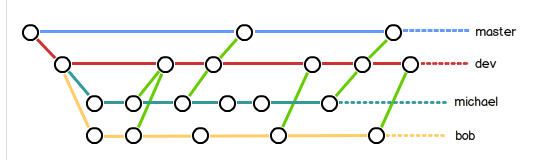

# Git

## 什么是Git

git是目前是世界上最先进的分布式版本控制系统

git使用C语言开发

集中式版本控制？分布式版本控制？

集中式：版本库是集中放在中央服务器的，干活用 的都是自己的电脑。干完活再将自己的代码推送给中央服务器。缺点：必须联网才能工作。

分布式：没有中央服务器，每个人的电脑就是版本库，

## 安装Git

```dos
sudo apt-get install git
```

```
apt install git
```

安装完成过后，需要自报家门

```
git config --global user.name  "YuanSai"
```

```
git config --global user.email "yuans_70g@163.com"
```

## 创建版本库

**创建文件夹**

```
mkdir repo
```

**将目录变成可以被git管理的仓库**

```
git init
```

查看目录下所有文件

```
ls -ah
```

创建一个名为`readme.txt`的文件

```
touch readme.txt
```

也可以直接使用`vi`来创建并编辑文件

```
vi readme.txt
```

输入任意内容后，点击esc，输入`:wq`保存并退出。使用`cat`查看文件内容

**告诉git，将文件放入仓库**

```
git add readme.txt
```

**用命令`git commit`告诉Git，把文件提交到仓库**

```
git commit -m "wrote a readme file "
```

重新修改readme.txt

```
vi readme.txt
```

**时刻查看仓库当前状态**

```
git status
```

```
On branch master
Changes not staged for commit:
  (use "git add <file>..." to update what will be committed)
  (use "git checkout -- <file>..." to discard changes in working directory)

        modified:   readme.txt

no changes added to commit (use "git add" and/or "git commit -a")
```

我们可以看到他告知我们readme.txt已经被修改

**查看修改内容**

```
git diff
```

## 版本回退

**查看历史记录**

```
git log
```

**查看历史记录的精简信息**

```
git log --pretty=oneline
```

**回到上一个版本**

```
git reset --hard HEAD^ 
git reset --hard HEAD^^ 回到上上个版本
git reset --hard HEAD~100 往上100个版本
```

现在继续执行`git log`会发现最近的版本没有了，想回到这个版本可以使用

```
f8dc4c82ac806edb425c8e8a1467ee8178dc48ca more
8068ebbce01498ef7d4e4a85607fd2de2be5e0d5 distributed
c08068b54c27646c81db9584954201b43b1d665b wrote a readme file
```

```
git reset --hard f8dc4   回到最新的版本
```

**记录你的每一次命令**

```
git reflog
```

## 工作区和暂存区

工作区：就是电脑里能看到的目录，比如：repo

版本库：工作区的隐藏目录`.git`。版本库里最重要的东西就是`stage`或`index`的暂存区，还有git为我们创建的第一个分支`master`，以及指向`master`的指针叫`HEAD`

修改的文件通过Add提交到暂存区，通过commit提交到分支

## 管理暂存

git追踪的是修改，而不是文件。

查看工作区和版本库的区别

```
git diff HEAD --   readme.txt
```

## 撤销修改

撤销**工作区**修改

```
git checkout -- readme.txt
```

撤销**暂存区**修改

```
git reset HEAD readme.txt
```

## 删除文件

```
rm test.txt
```

从版本库中删除文件,更改玩之后，需要重新提交

```
git rm test.txt
```

也可以从版本库重新下载文件

```
 git checkout -- test.txt
```

## 添加远程库

### **创建SSH Key**

```
ssh-keygen -t rsa -C "yuans_70g@163.com"
```

进入`~/.ssh`查看文件是否已经生成,将生成公钥放入GitHub，新建仓库，将仓库与本地仓库绑定

```
 git remote add origin https://github.com/NewPanForMe/repo.git
```

或者使用SSH方式

```
git remote add origin git@github.com:NewPanForMe/repo.git
```

```
git push -u origin master
```

只要已经做了提交，后面只需要

```
git push  origin master
```

第一次push或者clone时，会报

```
The authenticity of host 'github.com (xx.xx.xx.xx)' can't be established.
RSA key fingerprint is xx.xx.xx.xx.xx.
Are you sure you want to continue connecting (yes/no)?
```

这是因为git时SSH链接，SSH链接在第一次验证GitHub服务器的Key时，需要你确认GItHub的key的指纹信息是否真的来自GitHub的服务器。

Git会输出一个警告，告诉你已经将GitHub的Key放到信任列表里面了

```
Warning: Permanently added 'github.com,20.205.243.166' (ECDSA) to the list of known hosts.
```

删除远程库

```
git remote rm origin
```

这个删除只是解除了本地和远程的绑定关系，并没有物理删除。物理删除需要在GitHub上操作

## 从远程库克隆

```
 git clone git@github.com:NewPanForMe/GitSkills.git
```

## 创建和合并分支

我自己新建一个分支，不影响别人。

**创建并切换分支**

```
git checkout -b dev
```

相当于

```
git branch dev
git checkout dev
```

**查看当前分支**

```
git branch
```

**切换分支**

```
git checkout main
```

**合并`dev`分支**

```
git merge dev 
```

```
Updating 823f9c0..88b881a
Fast-forward
 README.md | 3 ++-
 1 file changed, 2 insertions(+), 1 deletion(-)
```

`Fast-forward`告诉我们这次合并是快进模式，也就是直接把dev的修改直接合并到main上

**删除`dev`分支**

```
git branch -d dev
```

## 解决冲突

当Git无法自动合并分支时，就必须首先解决冲突。解决冲突后，再提交，合并完成。

解决冲突就是把Git合并失败的文件手动编辑为我们希望的内容，再提交。

用`git log --graph`命令可以看到分支合并图。

## 分支管理策略

在合并分支时，git会用`fast-forawrd`模式，但是这种模式下，删除分支后，就会丢掉分支信息。

**合并禁用`fast-forawrd`**

```
git merge --no-ff -m "merge with no-ff" dev
```

master分支应该是非常稳定的版本，不应该在上面干活

干活应该在dev分支上，提交时往dev上提交



**查看分支历史**

```
 git log --graph --pretty=oneline --abbrev-commit
```

## BUG分支

git stash可以将工作隐藏起来。

**分支储藏**

```
 git stash
```

**查看所有分支隐藏信息**

```
git stash list
```

先查看工作区是否干净

```
git status
```

切换到main节点，因为bug出现在main节点

```
git checkout main
```

创建并切换分支issue-101

```
git checkout -b issue-101
```

修改bug文件

```
vim bugFile.txt
```

提交

```
git add bugFile.txt
git commit -m "Fix Bug"
```

切换到主分支

```
git checkout main
```

合并分支

```
 git merge --no-ff -m "你好" issue-101
```

删除分支

```
 git branch -d issue-101
```

===========================

恢复隐藏分支

```
git stash apply
```

但是stash内容不删除，需要使用

```
git stash drop
```

来删除。

也可以使用

```
git stash pop
```

来恢复并删除stash内容

恢复指定的statsh

```
git stash apply stash@{0}
```

## Feature分支

```
 git checkout -b feature-vulcan
```

```
 git branch -D feature-vulcan   丢弃分支
```

## 多人协作

**查看远程库的信息**

```
git remote
```

**查看远程库的详细信息**

```
git remote -v 
```

**推送分支**

```
git push origin main
```

**推送其他分支**

```
git push origin dev
```

现在，你的小伙伴要clone你的库

```
git clone git@github.com:NewPanForMe/GitSkills.git
```

想要在dev上开发

```
git checkout -b dev origin/dev
```

执行上面的代码，出错

```
 Cannot update paths and switch to branch 'dev' at the same time.
Did you intend to checkout 'origin/dev' which can not be resolved as commit?
```

原因：未将本地库与远程库关联。执行

```
  git remote add origin https://github.com/NewPanForMe/repo.git
```

```
 git fetch origin
```

这个地方不想看了

看的头疼

## 创建标签

在需要创建标签分支下，执行

```
git tag v1.0
```

也可以使用`git tag`查看所有标签

```
git tag
```

**查看历史提交记录**

```
 git log --pretty=oneline --abbrev-commit
```

```
80b8a60 add file vulcan.py
f985f40 aaaa
bfa9555 你好
0a9a11c Fix Bug
910ff1b add BugFile
d3ce991 fix bug 101
c1b53b9 way
fa819f1 cdf
b1c18d9 add simple2
116953f add simple
```

**对某一次提交加tag**

```
git tag v0.8 80b8a60
```

标签不是按照时间顺序排序的，而是按照字母顺序排序的。

**查看标签信息**

```
git show v1.0
```

**给标签添加按说明性文字**

```
 git tag -a v0.7 -m "version 0.8 released" f985f40
```

## 操作标签

**删除标签**

```
git tag -d v0.6
```

**推送标签**

```
git push origin v1.0
```

**推送所有标签**

```
 git push origin --tag
```

**删除远程库上的标签**

```
 git push origin :refs/tags/v0.7
```

删除结果需要 在GitHub上查看

## 自定义Git

给项目加上颜色

```
git config --global color.ui true
```

## 配置别名

使用`st`替代`status`

```
git config --global alias.st status
```


