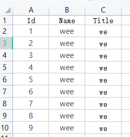
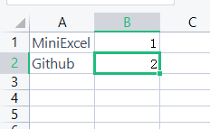
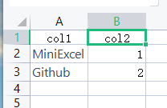
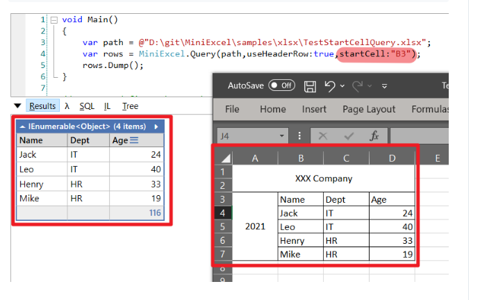
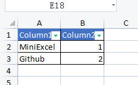
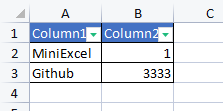
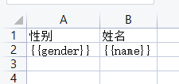
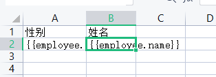
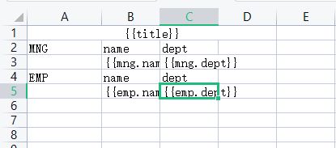

# 读

## 基础使用



```C#
var tests = MiniExcel.Query<Test>(path).ToList();
tests.ForEach(Console.WriteLine);
```

```C#
public record Test
{
    public int Id {get; set; }
    public string Name { get; set; } = string.Empty;
    public string Title { get; set; } = string.Empty;
}
```

列名称需要与实体类的属性名称一致！区分大小写

## 无列名使用

```C#
var tests = MiniExcel.Query(path).ToList();
tests.ForEach(x => Console.WriteLine($"{x.A}_{x.B}"));
```



## 有列名无实体类



```C#
var tests = MiniExcel.Query(path, useHeaderRow: true).ToList();
tests.ForEach(x => Console.WriteLine($"{x.col1}_{x.col2}"));
```

## 支持Linq查询

```C#
var tests = MiniExcel.Query(path, useHeaderRow: true).First();
Console.WriteLine($"{tests.col1} | {tests.col2}");
```

## 查询指定Sheet

```C#
var tests = MiniExcel.Query(path,useHeaderRow:true,sheetName:"Sheet2").ToList();
tests.ForEach(x => Console.WriteLine($"{x.col1}_{x.col2}"));
```

## 查询所有Sheet

```C#
var sheetNames = MiniExcel.GetSheetNames(path);
sheetNames.ForEach(x =>
{
   var tests = MiniExcel.Query(path,useHeaderRow:true,sheetName:x).ToList();
   tests.ForEach(a => Console.WriteLine($"{a.col1}_{a.col2}"));
});
```

## 查找所有数据列列名

```C#
var collection = MiniExcel.GetColumns(path,sheetName:"Sheet2");
foreach (var s in collection)
{
    Console.WriteLine(s);
}
```

## 查询数据为DataTable<当前已弃用>

```C#
var queryAsDataTable = MiniExcel.QueryAsDataTable(path);
```

## 从某个单元格开始读

```C#
var tests = MiniExcel.Query(path,useHeaderRow:true,startCell:"B1").ToList();
tests.ForEach(x => Console.WriteLine(x.col2));
```



# 写

## 支持匿名类别的集合

```C#
var path = Path.Combine(Path.GetTempPath(), $"{Guid.NewGuid()}.xlsx");
MiniExcel.SaveAs(path, new[] {
    new { Column1 = "MiniExcel", Column2 = 1 },
    new { Column1 = "Github", Column2 = 2}
});
```



## IEnumerable<IDictionary<string, object>>

```C#
var values = new List<Dictionary<string, object>>()
{
    new Dictionary<string,object>
    {
        { "Column1", "MiniExcel" }, 
        { "Column2", 1 }
    },
    new Dictionary<string,object>
    {
        { "Column1", "Github" }, 
        { "Column2", 3333 }
    }
};
MiniExcel.SaveAs(path, values);
```




## IDataReader

从数据库读取的数据

```C#
MiniExcel.SaveAs(path, reader);
```

推荐 DataReader 多表格导出方式(建议使用 Dapper ExecuteReader )

```C#
using (var cnn = Connection)
{
    cnn.Open();
    var sheets = new Dictionary<string,object>();
    sheets.Add("sheet1", cnn.ExecuteReader("select 1 id"));
    sheets.Add("sheet2", cnn.ExecuteReader("select 2 id"));
    MiniExcel.SaveAs("Demo.xlsx", sheets);
}
```

## 创建多个工作表

```C#

// 1. Dictionary<string,object>
var users = new[] { new { Name = "Jack", Age = 25 }, new { Name = "Mike", Age = 44 } };
var department = new[] { new { ID = "01", Name = "HR" }, new { ID = "02", Name = "IT" } };
var sheets = new Dictionary<string, object>
{
    ["users"] = users,
    ["department"] = department
};
MiniExcel.SaveAs(path, sheets);
```

## 表格样式

```C#
var config = new OpenXmlConfiguration()
{
    TableStyles = TableStyles.None
};
```

# 导出

## 基本模板填充

```C#
var templatePath = "D:\\System\\System\\test.xlsx";
var path = Path.Combine(Path.GetTempPath(), $"{Guid.NewGuid()}.xlsx");
```




```C#
var tests = new 
{
     gender = "南",name = "袁赛"
};
MiniExcel.SaveAsByTemplate(path, templatePath, tests);
```

## 批量数据填充

```C#

var tests = new
{
    employee = new[]
   {
      new { gender = "南", name = "袁赛"},
      new { gender = "南2", name = "袁赛2"},
      new { gender = "南33", name = "袁赛33"},
   }
};
MiniExcel.SaveAsByTemplate(path, templatePath, tests);
```



## 复杂数据导出



```C#
var value = new
{
    title = "FooCompany",
    mng = new[] {
        new {name="Jack",dept="HR"},
        new {name="Loan",dept="IT"}
    },
    emp = new[] {
        new {name="Wade",dept="HR"},
        new {name="Felix",dept="HR"},
        new {name="Eric",dept="IT"},
        new {name="Keaton",dept="IT"}
    }
};
MiniExcel.SaveAsByTemplate(path, templatePath, value);
```

