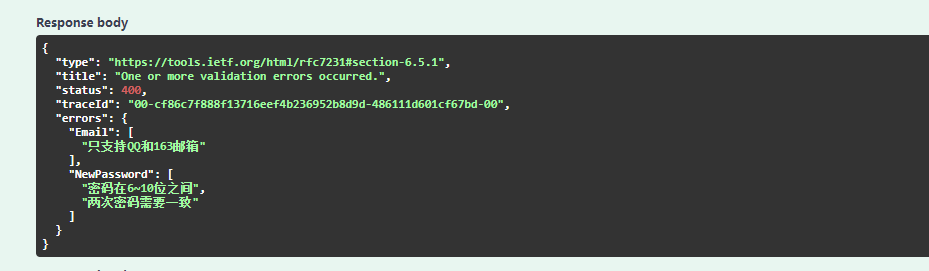
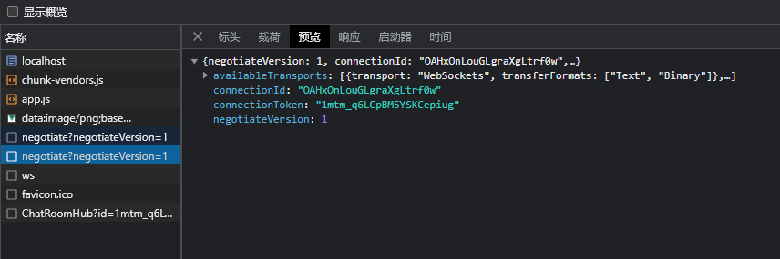
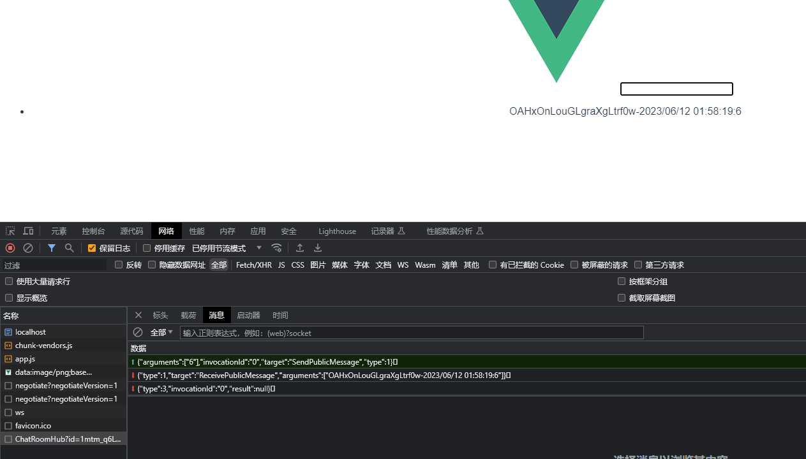
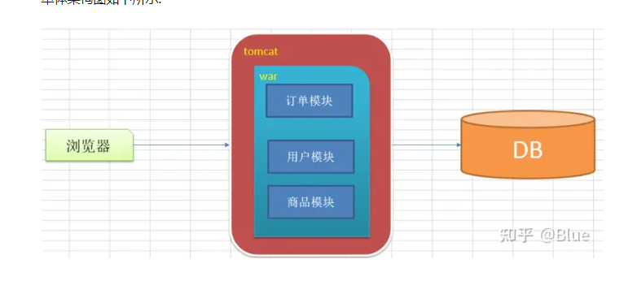
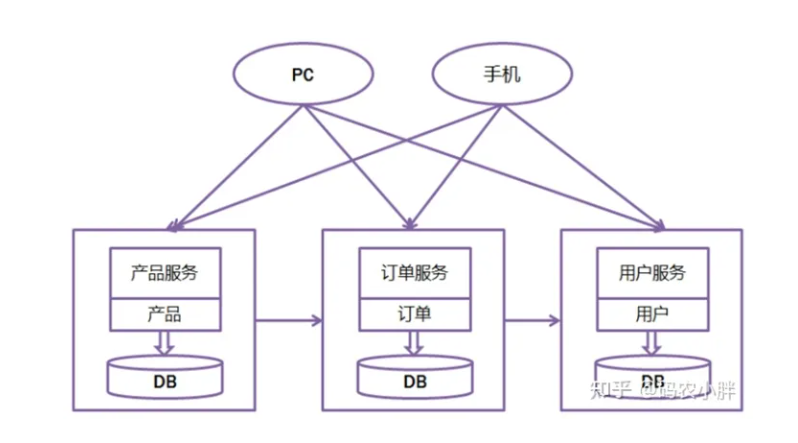

# c#中高级学习笔记

.net framework:windows程序

.net standard:标准

只是定义，没有实现

.net core:跨平台

> .Net Core 是跨平台的，高性能的开发平台


## 系统中优先使用异步方法

## Startup默认格式

```c#
public class Startup
{
    public Startup(IConfiguration configuration)
    {
        Configuration = configuration;
    }

    public IConfiguration Configuration { get; }

    // This method gets called by the runtime. Use this method to add services to the container.
    // 该方法由运行时调用，使用该方法向DI容器添加服务
    public void ConfigureServices(IServiceCollection services)
    {
    }

    // This method gets called by the runtime. Use this method to configure the HTTP request pipeline.
    // 该方法由运行时调用，使用该方法配置HTTP请求管道
    public void Configure(IApplicationBuilder app, IWebHostEnvironment env,IHostApplicationLifetime appLifetime)
    {
    }
}

```

```C#
using BMS_Base.Config;
using Consul;

namespace BMS;

public class Startup
{

    private readonly IConfiguration _configuration;

    public Startup(IConfiguration configuration)
    {
        this._configuration = configuration;
    }
    // This method gets called by the runtime. Use this method to add services to the container.
    // 该方法由运行时调用，使用该方法向DI容器添加服务
    public void ConfigureServices(IServiceCollection services)
    {
        services.AddMvc();
        services.AddControllers();
        services.AddEndpointsApiExplorer();
        services.AddSwaggerGen();
        services.AddCors(options =>
        {
            options.AddPolicy("AllowAllOrigin", builder =>
            {
                builder
                    .SetIsOriginAllowed(_ => true)
                    .AllowAnyMethod()
                    .AllowAnyHeader()
                    .AllowCredentials();
            });
        });

        services.Configure<ConsulConfig>(_configuration.GetSection("ConsulConfig"));
        _configuration.Bind("ConsulConfig", ConsulConfig.Instance);
        Console.WriteLine( ConsulConfig.Instance);
    }

    // This method gets called by the runtime. Use this method to configure the HTTP request pipeline.
    // 该方法由运行时调用，使用该方法配置HTTP请求管道
    public void Configure(IApplicationBuilder app, IWebHostEnvironment env, IHostApplicationLifetime appLifetime)
    {
        if (env.IsDevelopment())
        {
            app.UseSwagger();
            app.UseSwaggerUI();
        }

        app.UseRouting();
        app.UseAuthorization();
        app.UseEndpoints(x =>
        {
            x.MapControllers();
            x.MapGet("/", async context =>
            {
                await context.Response.WriteAsync("Hello World!");
            });
        });
        app.UseCors("AllowAllOrigin");
        RegisterConsul(appLifetime);
    }

    private void RegisterConsul(IHostApplicationLifetime appLifetime)
    {
        using var client = new ConsulClient(x => x.Address = new Uri("http://127.0.0.1:8500"));
        var check = new AgentServiceCheck()
        {
            DeregisterCriticalServiceAfter = TimeSpan.FromSeconds(5),//服务停止后，5s开始接触注册
            HTTP = ConsulConfig.Instance.CheckApi,//健康检查
            Interval = TimeSpan.FromSeconds(10),//每10s轮询一次健康检查
            Timeout = TimeSpan.FromSeconds(5),
        };
        var service = new AgentServiceRegistration()
        {
            Checks = new[] { check },
            ID = Guid.NewGuid().ToString(),
            Name = ConsulConfig.Instance.ServiceName,
            Port = ConsulConfig.Instance.Port,
            Address = ConsulConfig.Instance.Address
        };
        client.Agent.ServiceRegister(service).Wait();
        appLifetime.ApplicationStopped.Register(() =>
        {
            Console.WriteLine("服务停止中");
            using var consulClient = new ConsulClient(x => x.Address = new Uri("http://127.0.0.1:8500"));
            consulClient.Agent.ServiceDeregister(service.ID).Wait();
        });
    }
}
```


```C#
CreateHostBuilder(args).Build().Run();
static IHostBuilder CreateHostBuilder(string[] args) =>
   Host.CreateDefaultBuilder(args)
       .ConfigureWebHostDefaults(webBuilder =>
       {
           webBuilder.UseStartup<Startup>();
       });
```

## Ocelot

```json
{
    "ReRoutes": [],
    "GlobalConfiguration": {}
}
```

```josn
{
    "Routes": [
        {
            "DownstreamPathTemplate": "/api/{url}",
            "DownstreamScheme": "http",
            "DownStreamHostAndPorts": [
                {
                    "Host": "localhost",
                    "Port": "5086"
                }
            ],
            "UpstreamPathTemplate": "/ServiceA/{url}",
            "UpstreamHttpMethod": [ "Get", "Post" ],
            "ServiceName": "ServiceA",
            "UseServiceDiscovery": true
            //"LoadBalanceOptions": {
            //    "Type": "RoundRobin"
            //}
        },
        {
            "DownstreamPathTemplate": "/api/{url}",
            "DownstreamScheme": "http",
            "DownStreamHostAndPorts": [
                {
                    "Host": "localhost",
                    "Port": "5087"
                }
            ],
            "UpstreamPathTemplate": "/ServiceB/{url}",
            "UpstreamHttpMethod": [ "Get", "Post" ],
            "ServiceName": "ServiceB",
            "UseServiceDiscovery": true
            //"LoadBalanceOptions": {
            //    "Type": "RoundRobin"
            //}
        }
    ],
    "GlobalConfiguration": {
        "BaseUrl": "http://localhost:5131",
        "ServiceDiscoveryProvider": {
            "Host": "localhost",
            "Port": 8500,
            "Type": "Consul"
        }
    }
}

```

**LoadBalanceOptions**

LeastConnection - 最少连接，跟踪哪些服务正在处理请求，并把新请求发送到现有请求最少的服务上。该算法状态不在整个Ocelot集群中分布。

RoundRobin - 轮询可用的服务并发送请求。 该算法状态不在整个Ocelot集群中分布。

NoLoadBalancer - 不负载均衡，从配置或服务发现提供程序中取第一个可用的下游服务。

CookieStickySessions - 使用cookie关联所有相关的请求到制定的服务。下面有更多信息。

```josn
 {
            "DownstreamPathTemplate": "/Light/api/{all}",
            "UpstreamPathTemplate": "/api/manhui_wms_light/{all}",
            "UpstreamHttpMethod": ["Get", "Post"],
            "DownstreamHttpMethod": null,
            "AddHeadersToRequest": {},
            "UpstreamHeaderTransform": {},
            "DownstreamHeaderTransform": {},
            "AddClaimsToRequest": {},
            "RouteClaimsRequirement": {},
            "AddQueriesToRequest": {},
            "ChangeDownstreamPathTemplate": {},
            "RequestIdKey": null,
            "FileCacheOptions": { "TtlSeconds": 0, "Region": null },
            "RouteIsCaseSensitive": false,
            "ServiceName": "manhui_wms_light",
            "ServiceNamespace": null,
            "DownstreamScheme": "http",
            "QoSOptions": { "ExceptionsAllowedBeforeBreaking": 0, "DurationOfBreak": 0, "TimeoutValue": 0 },
            "LoadBalancerOptions": { "Type": "LeastConnection", "Key": null, "Expiry": 0 },
            "RateLimitOptions": { "ClientWhitelist": [], "EnableRateLimiting": false, "Period": null, "PeriodTimespan": 0.0, "Limit": 0 },
            "AuthenticationOptions": { "AuthenticationProviderKey": null, "AllowedScopes": [] },
            "HttpHandlerOptions": { "AllowAutoRedirect": false, "UseCookieContainer": false, "UseTracing": false, "UseProxy": true, "MaxConnectionsPerServer": 2147483647 },
            "DownstreamHostAndPorts": [],
            "UpstreamHost": null,
            "Key": null,
            "DelegatingHandlers": [],
            "Priority": 1,
            "Timeout": 0,
            "DangerousAcceptAnyServerCertificateValidator": false,
            "SecurityOptions": { "IPAllowedList": [], "IPBlockedList": [] },
            "DownstreamHttpVersion": null
        },
```

**可使用的网关配置**

```C#
{
    "Routes": [
        {
            "DownstreamPathTemplate": "/api/{url}",
            "DownstreamScheme": "http",
            "UpstreamPathTemplate": "/ServiceA/{url}",
            "UpstreamHttpMethod": [ "Get", "Post" ],
            "ServiceName": "ServiceA",
            "UseServiceDiscovery": true,
            "LoadBalancerOptions": {
                "Type": "LeastConnection"
            }
        },
        {
            "DownstreamPathTemplate": "/api/{url}",
            "DownstreamScheme": "http",
            "UpstreamPathTemplate": "/ServiceB/{url}",
            "UpstreamHttpMethod": [ "Get", "Post" ],
            "ServiceName": "ServiceB",
            "UseServiceDiscovery": true,
            "LoadBalancerOptions": {
                "Type": "LeastConnection"
            }
        }
    ],
    "GlobalConfiguration": {
        "ServiceDiscoveryProvider": {
            "Host": "localhost",
            "Port": 8500,
            "Type": "Consul"
        }
    }
}
```


## EFContext基础模板

```C#
public class BmsV1DbContext : DbContext
{
    public BmsV1DbContext(DbContextOptions<BmsV1DbContext> options) : base(options) { }
    protected override void OnModelCreating(ModelBuilder modelBuilder)
    {
        base.OnModelCreating(modelBuilder);
        modelBuilder.ApplyConfigurationsFromAssembly(this.GetType().Assembly);
    }
}
```

需要使用 Microsoft.EntityFrameworkCore包


## 数据库链接字符串

### PostgreSQL

```SQl
Host=118.178.241.151;Username=postgres;Database=version;Port=54321
```

### SQL Server

```SQl
server=192.168.31.126;database=EFLearn;user id=sa;password=123456;TrustServerCertificate=true
```

sql server 新建Select锁

```sql
select * from T_House  WITH (HOLDLOCK) 
```

### MySQL

```sql
server=192.168.31.126;database=webapp;user id=root;password=123456;
```


## 入门


### 为什么要跨平台

#### 1，安全原因

#### 2，成本原因

#### 3，软件生态


> net core不是Framework的升级版.是从头开发的平台


### 为什么Framework不适合用来开发云平台的程序

#### 1.Framework属于系统级别的程序。

所有项目共享一个安装实例。如果某个程序需要单独安装补丁，那么其他程序也会受影响

#### 2，Framework必须与操作系统绑定在一起。

不能与应用一起打包独立部署

#### 3，ASP.Net与IIS深度耦合。

Asp只能运行在IIS上，IIS只能运行在windows上，不同版本的Windows系统IIS版本也不同。

#### 4，AspNet消耗 的资源较大。

#### 5，Framework诞生时，没有云的概念。

>Api application programs interface 应用程序接口


### NetCore优点

#### 1,Core采用模块化开发.

Core的核心文件很少,需要单独安装.

#### 2,支持独立部署.

Core打包,运行时环境与开发程序一起打包.

#### 3,程序的运行效率更高

Core的所有管道都是可插拔的.我们可以决定程序的管道及执行顺序.

#### 4,Core内置了Kestrel,一个简单高效的Web服务器.

安全,https限流,压缩,缓存等功能则由部署在前的IIS等代理服务器完成.

#### 5,Core更符合现在的编程罗技思想

支持了依赖注入,支持单元测试等.


### 还没有被Core支持的Framework技术

#### 1,WinForms WPF

与Windows平台深度耦合.Core3.0开始,开发的Winform,WPF程序只能运行在Windows下.不能跨平台.Core开发的

好处:独立部署,模块化,更高性能.

#### 2,WebForms

技术过时.

#### 3,WCF服务端

不被支持,未来也不会被支持.

需要使用可以用CoreWCF.

#### 4,WF (Workflow foundation,工作流框架)

推荐workflow Core

#### 5,Net Romoting

微软私有协议,性能不理想.

替代:gRPC,core内置了对gRPC的支持.

#### 6,App Domain

Framework中对代码进行进程隔离.

#### Framework的特有技术

WMI (windows management instrumentation ,windows管理规范)

ODBC (open database connectivity ,开放式数据库互联)

Windows ACL ( Access control list,访问控制列表)

Code page

Windows事件日志

WIndows性能计数器

Windows注册表

Directory Services

>在Core中,我们可以通过WIndows Compatibility Pack 继续使用上述功能.


### Net Standard是什么

是一个提供基础方法的类库。没有实现。

只是规范。

## 基础

### 运行typeof(FileStream).Assembly.Location

typeof(FileStream).Assembly.Location

typeof(Class1).Assembly.Location

Core

C:\Program Files\dotnet\shared\Microsoft.NETCore.App\6.0.14\System.Private.CoreLib.dll
D:\C#\Project\LearnCSharp\CoreConsole1\bin\Debug\net6.0\LearnCSharp.dll

Frmaework

C:\Windows\Microsoft.NET\Framework\v4.0.30319\mscorlib.dll
D:\C#\Project\LearnCSharp\FrameWorkConsole1\bin\Debug\LearnCSharpFrameWork.dll

### 反编译工具：ILSpy

.net standard类库，可以呗其他类型的引用。

其他的类库不能呗不是其对应类型的引用

### window自带虚拟机：SandBox

### 自带linux：wsl 

readyToRun:启动速度变快，编译速度变慢

裁剪：系统判断哪些类库不需要，编译时就不添加。反射慎用

另一个我反编译工具：dnSpy


## Core重难点知识

### 新语法

#### 1，顶级语句

```C#
int i=1,j=2;
int k=Add(i,j);
await File.WriteAllTextAsync("e:/1.txt","hello "+k);
int Add(int x, int y)
{
    return x + y;
}
```

新建控制台项目。在Programs.cs中添加上面代码。

#### 2，全局using指令

```C#
global using System.Text;
global using System.Text.Json;
```

全局引用需要在类引用的前面。

```xml
  <ImplicitUsings>enable</ImplicitUsings>
```

在.csproj文件中，增加如上代码，编译器会根据项目类型自动引入常用命名空间。

#### 3，using声明

举例：读取数据库表的代码

```C#
using (var conn = new SqlConnection(connStr))
{
    conn.Open();
    using (var cmd = conn.CreateCommand())
    {
        cmd.CommandText = "select * from sys_user";

        using (var reader=cmd.ExecuteReader())
        {
            while (reader.Read()) { }
        }
    }
}
```

```C#
using var conn = new SqlConnection(connStr);
conn.Open();
using var cmd = conn.CreateCommand();
cmd.CommandText = "select * from sys_user";
using var reader=cmd.ExecuteReader();
while (reader.Read()) { }
```

**注意：conn、cmd、reader的资源回收会在超出变量作用域之后。**

举例：读取文件的例子

```C#
var path = "e:/1.txt";
using var reader = File.OpenWrite(path);
using var writer=  new StreamWriter(reader);
writer.WriteLine("Hello");
var s = File.ReadAllText(path);
Console.WriteLine(s);
Console.ReadLine();
```


变量s在读取时，仍然在reader的作用域内，需要增加作用域`{}`

```C#
var path = "e:/1.txt";
{
    using var reader = File.OpenWrite(path);
    using var writer = new StreamWriter(reader);
    writer.WriteLine("Hello");
}
var s = File.ReadAllText(path);
Console.WriteLine(s);
Console.ReadLine();
```

#### 4，文件范围的命名空间

##### 简化命名空间声明

```C#
namespace CoreConsole1.Using;
public class UsingExample1
{
    public void GetData()
    {
        var connStr = "Server=118.178.241.151:54321;User Id=postgres;Password=123456;Database=version";
        using var conn = new SqlConnection(connStr);
        conn.Open();
        using var cmd = conn.CreateCommand();
        cmd.CommandText = "select * from sys_user";
        using var reader = cmd.ExecuteReader();
        while (reader.Read()) { }
    }
}
```

#### 5，可为空的引用类型

例：

```C#
public class Student
{
    public int Id { get; set; }
    public string Name { get; set; }
    public string PhoneNum { get; set; }

    public Student(string name)
    {
        this.Name = name;
    }
}
```

此时编译器会提示。


在对应属性的类型后面添加？

```C#
 public string? PhoneNum { get; set; }
```

在使用代码时：

```C#
using CoreConsole1.Model;
Student student = GetData();
Console.WriteLine(student.PhoneNum.ToLower());
Console.WriteLine(student.Name.ToLower());
Student GetData()
{
    Student s = new Student("YuanSai")
    {
        PhoneNum = "1234567"
    };
    return s;
}
```


可以改成下面的写法,就不会有null引用异常

```C#
using CoreConsole1.Model;

Student student = GetData();
Console.WriteLine(string.IsNullOrEmpty(student.PhoneNum) ? "": student.PhoneNum.ToLower());
Console.WriteLine(student.Name.ToLower());
Student GetData()
{
    Student s = new Student("YuanSai")
    {
        PhoneNum = "1234567"
    };
    return s;
}
```

##### 使用！抑制警告

```C#
using CoreConsole1.Model;

Student student = GetData();
Console.WriteLine(student.PhoneNum!.ToLower());
Console.WriteLine(student.Name.ToLower());
Student GetData()
{
    Student s = new Student("YuanSai")
    {
        PhoneNum = "1234567"
    };
    return s;
}
```

不建议使用

#### 6，记录类型

##### 基础record使用

```C#
using CoreConsole1.Model;

Person  p1 = new Person("Sai","Yuan");
Person  p2 = new Person("Sai","Yuan");
Person  p3 = new Person("Sai","XXX");
Console.WriteLine(p1);
Console.WriteLine(p1==p2);
Console.WriteLine(p1==p3);
Console.WriteLine(p1.FirstName);
```

```C#
public record Person(string FirstName, string LastName);
```


通过反编译查看record内容

```C#
public record Person(string FirstName, string LastName)
{
	[CompilerGenerated]
	protected virtual Type EqualityContract
	{
		[CompilerGenerated]
		get
		{
			return typeof(Person);
		}
	}

	[CompilerGenerated]
	public override string ToString()
	{
		StringBuilder stringBuilder = new StringBuilder();
		stringBuilder.Append("Person");
		stringBuilder.Append(" { ");
		if (PrintMembers(stringBuilder))
		{
			stringBuilder.Append(' ');
		}
		stringBuilder.Append('}');
		return stringBuilder.ToString();
	}

	[CompilerGenerated]
	protected virtual bool PrintMembers(StringBuilder builder)
	{
		RuntimeHelpers.EnsureSufficientExecutionStack();
		builder.Append("FirstName = ");
		builder.Append((object?)FirstName);
		builder.Append(", LastName = ");
		builder.Append((object?)LastName);
		return true;
	}

	[CompilerGenerated]
	public override int GetHashCode()
	{
		return (EqualityComparer<Type>.Default.GetHashCode(EqualityContract) * -1521134295 + EqualityComparer<string>.Default.GetHashCode(FirstName)) * -1521134295 + EqualityComparer<string>.Default.GetHashCode(LastName);
	}

	[CompilerGenerated]
	public virtual bool Equals(Person? other)
	{
		return (object)this == other || ((object)other != null && EqualityContract == other!.EqualityContract && EqualityComparer<string>.Default.Equals(FirstName, other!.FirstName) && EqualityComparer<string>.Default.Equals(LastName, other!.LastName));
	}

	[CompilerGenerated]
	protected Person(Person original)
	{
		FirstName = original.FirstName;
		LastName = original.LastName;
	}
}

```

**注意**

record所有属性默认只读。

#### 高级record用法

```C#
public record Person(string LastName)
{
    public string FirstName { get; set; } = string.Empty;

    public void SayHello()
    {
        Console.WriteLine($"Hello, {LastName} {FirstName}");
    }
}
```

```C#
using CoreConsole1.Model;

Person  p1 = new Person("Sai");
Person  p2 = new Person("Sai");
Person  p3 = new Person("Sai");
Console.WriteLine(p1);
Console.WriteLine(p1==p2);
p3.FirstName = "Yss";
Console.WriteLine(p1==p3);
p1.SayHello();
```


##### 给record方法提供额外的构造方法

```C#
namespace CoreConsole1.Model;
public record User(string UserName, string? Email, int Age)
{
    public User(string userName, int age) : this(userName, null, age)
    {

    }
}
```

调用

```C#
using CoreConsole1.Model;

User u1 = new User("yuanSai", 13);
User u2 = new User("yuanSai","example@qq.com",13);
```

rcord属性默认只读。

所有私有属性及成员变量都为只读的为不可变类型。可以简化程序逻辑，减少并发访问，状态管理等麻烦。

##### 手动创建record副本

```C#
using CoreConsole1.Model;

User u1 = new User("yuanSai", 13);
User u2 = new User(u1.UserName, "example@qq.com",u1.Age);
Console.WriteLine(u2);
```

当然，C#提供了更为方便的操作。


### 异步编程

#### 异步方法的使用

```C#
var path="e:/1.txt";
Console.WriteLine("开始写之前");
await  File.WriteAllTextAsync(path,"冲冲冲");
Console.WriteLine("开始读之前");
var readAllTextAsync = await File.ReadAllTextAsync(path);
Console.WriteLine(readAllTextAsync);
```


#### 自定义异步方法

下载Bing首页

```C#

Console.WriteLine("开始");

var downloadAsync = await DownloadAsync("https://cn.bing.com/","e:/bing.html");
Console.WriteLine($"供下载：{downloadAsync}");
async Task<int> DownloadAsync(string url,string location)
{
    using var httpClient = new HttpClient();
    var stringAsync = await httpClient.GetStringAsync(url);
    if (!string.IsNullOrEmpty(stringAsync))
    {
        await File.WriteAllTextAsync(location, stringAsync);
    }
    return stringAsync.Length;
}
```


##### 初探异步编程原理

结论：编译器将async编译成一个类，将异步方法中的代码切分成多次代码调用。

```C#
Console.WriteLine("开始");
var downloadAsync = await GetStringAsync("https://www.baidu.com/home");
Console.WriteLine(downloadAsync);
var path = "e:/1.txt";
var content = "Hello await and async";
await File.WriteAllTextAsync(path, content);
var readAllTextAsync = await File.ReadAllTextAsync(path);
Console.WriteLine(readAllTextAsync);
async Task<string> GetStringAsync(string url)
{
    using var httpClient = new HttpClient();
    var stringAsync = await httpClient.GetStringAsync(url);
    return stringAsync;
}
```

异步方法生成的程序集


```C#
[CompilerGenerated]
internal class Program
{
	// Token: 0x06000005 RID: 5 RVA: 0x00002094 File Offset: 0x00000294
	[DebuggerStepThrough]
	private static Task <Main>$(string[] args)
	{
		Program.<<Main>$>d__0 <<Main>$>d__ = new Program.<<Main>$>d__0();
		<<Main>$>d__.<>t__builder = AsyncTaskMethodBuilder.Create();
		<<Main>$>d__.args = args;
		<<Main>$>d__.<>1__state = -1;
		<<Main>$>d__.<>t__builder.Start<Program.<<Main>$>d__0>(ref <<Main>$>d__);
		return <<Main>$>d__.<>t__builder.Task;
	}

	// Token: 0x06000007 RID: 7 RVA: 0x000020E4 File Offset: 0x000002E4
	[DebuggerStepThrough]
	private static void <Main>(string[] args)
	{
		Program.<Main>$(args).GetAwaiter().GetResult();
	}

	// Token: 0x06000008 RID: 8 RVA: 0x00002104 File Offset: 0x00000304
	[NullableContext(1)]
	[DebuggerStepThrough]
	[CompilerGenerated]
	internal static Task<string> <<Main>$>g__GetStringAsync|0_0(string url)
	{
		Program.<<<Main>$>g__GetStringAsync|0_0>d <<<Main>$>g__GetStringAsync|0_0>d = new Program.<<<Main>$>g__GetStringAsync|0_0>d();
		<<<Main>$>g__GetStringAsync|0_0>d.<>t__builder = AsyncTaskMethodBuilder<string>.Create();
		<<<Main>$>g__GetStringAsync|0_0>d.url = url;
		<<<Main>$>g__GetStringAsync|0_0>d.<>1__state = -1;
		<<<Main>$>g__GetStringAsync|0_0>d.<>t__builder.Start<Program.<<<Main>$>g__GetStringAsync|0_0>d>(ref <<<Main>$>g__GetStringAsync|0_0>d);
		return <<<Main>$>g__GetStringAsync|0_0>d.<>t__builder.Task;
	}

	// Token: 0x0200000B RID: 11
	[CompilerGenerated]
	private sealed class <<<Main>$>g__GetStringAsync|0_0>d : IAsyncStateMachine
	{
		// Token: 0x06000038 RID: 56 RVA: 0x000026B4 File Offset: 0x000008B4
		void IAsyncStateMachine.MoveNext()
		{
			int num = this.<>1__state;
			string result;
			try
			{
				if (num != 0)
				{
					this.<httpClient>5__1 = new HttpClient();
				}
				try
				{
					TaskAwaiter<string> awaiter;
					if (num != 0)
					{
						awaiter = this.<httpClient>5__1.GetStringAsync(this.url).GetAwaiter();
						if (!awaiter.IsCompleted)
						{
							num = (this.<>1__state = 0);
							this.<>u__1 = awaiter;
							Program.<<<Main>$>g__GetStringAsync|0_0>d <<<Main>$>g__GetStringAsync|0_0>d = this;
							this.<>t__builder.AwaitUnsafeOnCompleted<TaskAwaiter<string>, Program.<<<Main>$>g__GetStringAsync|0_0>d>(ref awaiter, ref <<<Main>$>g__GetStringAsync|0_0>d);
							return;
						}
					}
					else
					{
						awaiter = this.<>u__1;
						this.<>u__1 = default(TaskAwaiter<string>);
						num = (this.<>1__state = -1);
					}
					this.<>s__3 = awaiter.GetResult();
					this.<stringAsync>5__2 = this.<>s__3;
					this.<>s__3 = null;
					result = this.<stringAsync>5__2;
				}
				finally
				{
					if (num < 0 && this.<httpClient>5__1 != null)
					{
						((IDisposable)this.<httpClient>5__1).Dispose();
					}
				}
			}
			catch (Exception exception)
			{
				this.<>1__state = -2;
				this.<httpClient>5__1 = null;
				this.<stringAsync>5__2 = null;
				this.<>t__builder.SetException(exception);
				return;
			}
			this.<>1__state = -2;
			this.<httpClient>5__1 = null;
			this.<stringAsync>5__2 = null;
			this.<>t__builder.SetResult(result);
		}

		// Token: 0x06000039 RID: 57 RVA: 0x000027F0 File Offset: 0x000009F0
		[DebuggerHidden]
		void IAsyncStateMachine.SetStateMachine([Nullable(1)] IAsyncStateMachine stateMachine)
		{
		}

		// Token: 0x0400000B RID: 11
		public int <>1__state;

		// Token: 0x0400000C RID: 12
		public AsyncTaskMethodBuilder<string> <>t__builder;

		// Token: 0x0400000D RID: 13
		public string url;

		// Token: 0x0400000E RID: 14
		private HttpClient <httpClient>5__1;

		// Token: 0x0400000F RID: 15
		private string <stringAsync>5__2;

		// Token: 0x04000010 RID: 16
		private string <>s__3;

		// Token: 0x04000011 RID: 17
		[Nullable(new byte[]
		{
			0,
			1
		})]
		private TaskAwaiter<string> <>u__1;
	}

	// Token: 0x0200000C RID: 12
	[CompilerGenerated]
	private sealed class <<Main>$>d__0 : IAsyncStateMachine
	{
		// Token: 0x0600003B RID: 59 RVA: 0x000027FC File Offset: 0x000009FC
		void IAsyncStateMachine.MoveNext()
		{
			int num = this.<>1__state;
			try
			{
				TaskAwaiter<string> awaiter;
				TaskAwaiter awaiter2;
				TaskAwaiter<string> awaiter3;
				switch (num)
				{
				case 0:
					awaiter = this.<>u__1;
					this.<>u__1 = default(TaskAwaiter<string>);
					this.<>1__state = -1;
					break;
				case 1:
					awaiter2 = this.<>u__2;
					this.<>u__2 = default(TaskAwaiter);
					this.<>1__state = -1;
					goto IL_13D;
				case 2:
					awaiter3 = this.<>u__1;
					this.<>u__1 = default(TaskAwaiter<string>);
					this.<>1__state = -1;
					goto IL_1AF;
				default:
					Console.WriteLine("开始");
					awaiter = Program.<<Main>$>g__GetStringAsync|0_0("https://www.baidu.com/home").GetAwaiter();
					if (!awaiter.IsCompleted)
					{
						this.<>1__state = 0;
						this.<>u__1 = awaiter;
						Program.<<Main>$>d__0 <<Main>$>d__ = this;
						this.<>t__builder.AwaitUnsafeOnCompleted<TaskAwaiter<string>, Program.<<Main>$>d__0>(ref awaiter, ref <<Main>$>d__);
						return;
					}
					break;
				}
				this.<>s__5 = awaiter.GetResult();
				this.<downloadAsync>5__1 = this.<>s__5;
				this.<>s__5 = null;
				Console.WriteLine(this.<downloadAsync>5__1);
				this.<path>5__2 = "e:/1.txt";
				this.<content>5__3 = "Hello await and async";
				awaiter2 = File.WriteAllTextAsync(this.<path>5__2, this.<content>5__3, default(CancellationToken)).GetAwaiter();
				if (!awaiter2.IsCompleted)
				{
					this.<>1__state = 1;
					this.<>u__2 = awaiter2;
					Program.<<Main>$>d__0 <<Main>$>d__ = this;
					this.<>t__builder.AwaitUnsafeOnCompleted<TaskAwaiter, Program.<<Main>$>d__0>(ref awaiter2, ref <<Main>$>d__);
					return;
				}
				IL_13D:
				awaiter2.GetResult();
				awaiter3 = File.ReadAllTextAsync(this.<path>5__2, default(CancellationToken)).GetAwaiter();
				if (!awaiter3.IsCompleted)
				{
					this.<>1__state = 2;
					this.<>u__1 = awaiter3;
					Program.<<Main>$>d__0 <<Main>$>d__ = this;
					this.<>t__builder.AwaitUnsafeOnCompleted<TaskAwaiter<string>, Program.<<Main>$>d__0>(ref awaiter3, ref <<Main>$>d__);
					return;
				}
				IL_1AF:
				this.<>s__6 = awaiter3.GetResult();
				this.<readAllTextAsync>5__4 = this.<>s__6;
				this.<>s__6 = null;
				Console.WriteLine(this.<readAllTextAsync>5__4);
			}
			catch (Exception exception)
			{
				this.<>1__state = -2;
				this.<downloadAsync>5__1 = null;
				this.<path>5__2 = null;
				this.<content>5__3 = null;
				this.<readAllTextAsync>5__4 = null;
				this.<>t__builder.SetException(exception);
				return;
			}
			this.<>1__state = -2;
			this.<downloadAsync>5__1 = null;
			this.<path>5__2 = null;
			this.<content>5__3 = null;
			this.<readAllTextAsync>5__4 = null;
			this.<>t__builder.SetResult();
		}

		// Token: 0x0600003C RID: 60 RVA: 0x00002A6C File Offset: 0x00000C6C
		[DebuggerHidden]
		void IAsyncStateMachine.SetStateMachine([Nullable(1)] IAsyncStateMachine stateMachine)
		{
		}

		// Token: 0x04000012 RID: 18
		public int <>1__state;

		// Token: 0x04000013 RID: 19
		public AsyncTaskMethodBuilder <>t__builder;

		// Token: 0x04000014 RID: 20
		public string[] args;

		// Token: 0x04000015 RID: 21
		private string <downloadAsync>5__1;

		// Token: 0x04000016 RID: 22
		private string <path>5__2;

		// Token: 0x04000017 RID: 23
		private string <content>5__3;

		// Token: 0x04000018 RID: 24
		private string <readAllTextAsync>5__4;

		// Token: 0x04000019 RID: 25
		private string <>s__5;

		// Token: 0x0400001A RID: 26
		private string <>s__6;

		// Token: 0x0400001B RID: 27
		[Nullable(new byte[]
		{
			0,
			1
		})]
		private TaskAwaiter<string> <>u__1;

		// Token: 0x0400001C RID: 28
		private TaskAwaiter <>u__2;
	}

```

反编译后的代码

##### 线程切换

```C#
Console.WriteLine($"1-TheadId={Thread.CurrentThread.ManagedThreadId}");
var str = new string('0',100000000);
var path = "e:/1.txt";
await File.WriteAllTextAsync(path, str);
Console.WriteLine($"2-TheadId={Thread.CurrentThread.ManagedThreadId}");
await File.WriteAllTextAsync("e:/2.txt", str);
Console.WriteLine($"3-TheadId={Thread.CurrentThread.ManagedThreadId}");
File.WriteAllText("e:/3.txt", str);
Console.WriteLine($"4-TheadId={Thread.CurrentThread.ManagedThreadId}");
```

`Thread.CurrentThread.ManagedThreadId`获得当前线程的ID


###### 结论：

在异步方法await调用等待期间，会先将当前线程返回至线程池，等异步方法调用完毕，再从线程池取出空闲线程来执行后续代码。

##### 异步方法不等于多线程

```C#
Console.WriteLine($"1-TheadId={Thread.CurrentThread.ManagedThreadId}");
Console.WriteLine(await CalcAsync(1000));
Console.WriteLine($"2-TheadId={Thread.CurrentThread.ManagedThreadId}");

async Task<double> CalcAsync(int n)
{
    Console.WriteLine($"CalcAsync-TheadId={Thread.CurrentThread.ManagedThreadId}");
    double res = 1;
    var ram = new Random();
    for (int i = 0; i < n*n; i++)
    {
        res += ram.NextDouble();
    }
    return res;

}
```


所有的线程ID都是同一个数字。说明异步!=多线程。

###### 通过Task.Run切换线程

```C#
Console.WriteLine($"1-TheadId={Thread.CurrentThread.ManagedThreadId}");
Console.WriteLine(await CalcAsync(1000));
Console.WriteLine($"2-TheadId={Thread.CurrentThread.ManagedThreadId}");
async Task<double> CalcAsync(int n)
{
    Console.WriteLine($"CalcAsync-TheadId={Thread.CurrentThread.ManagedThreadId}");
    return await Task.Run(() =>
    {
        Console.WriteLine($"Task.Run={Thread.CurrentThread.ManagedThreadId}");
        double res = 1;
        var ram = new Random();
        for (int i = 0; i < n * n; i++)
        {
            res += ram.NextDouble();
        }
        return res;
    });
}
```


##### 未使用async修饰的方法

如果方法的返回值就是Task<T>的话，就可以不是async和await

未用async修饰的方法，内部不可以使用await

```C#
var readContentAsync = await ReadContentAsync(1);
Console.WriteLine(readContentAsync);

async Task<string> ReadContentAsync(int n)
{
    switch (n)
    {
        case 1:
            return await File.ReadAllTextAsync("e:/1.txt");
            break;
        case 2:
            return await File.ReadAllTextAsync("e:/2.txt");
            break;
        default:
            throw new ArgumentOutOfRangeException();
    }
}
```

```C#
var readContentAsync = await ReadContentAsync(1);
Console.WriteLine(readContentAsync);

 Task<string> ReadContentAsync(int n)
{
    switch (n)
    {
        case 1:
            return  File.ReadAllTextAsync("e:/1.txt");
            break;
        case 2:
            return  File.ReadAllTextAsync("e:/2.txt");
            break;
        default:
            throw new ArgumentOutOfRangeException();
    }
}
```

##### 异步编程的几个重要问题

1，Core已经全面拥抱异步。大部分耗时的操作都有异步方法。

2，如果框架不支持，可以使用下面的写法.注意这种写法会死锁，不建议使用

```C#
var result = File.ReadAllTextAsync("e:/3.txt").Result;
Console.WriteLine(result);
var result2 = File.ReadAllTextAsync("e:/3.txt").GetAwaiter().GetResult();
Console.WriteLine(result2);
```

3，异步暂停（Delay）

```C#
using var httpClient = new HttpClient();
var stringAsync = await httpClient.GetStringAsync("https://www.zhipin.com/web/geek/chat?id=143b2025fbc504191nV43dq5FFBZ");
Console.WriteLine(stringAsync);
await  Task.Delay(3000);
Console.WriteLine("已经等待了3s");
var stringAsync2 = await httpClient.GetStringAsync("https://www.zhipin.com/web/geek/recommend");
Console.WriteLine(stringAsync2);
```

4，CancellationToken参数

可以通过这个参数让方法停止

5，需要等待多个异步方法结束

```C#
var result = File.ReadAllTextAsync("e:/1.txt");
var result2 = File.ReadAllTextAsync("e:/2.txt");
var result3 = File.ReadAllTextAsync("e:/3.txt");
var whenAll = await Task.WhenAll(result, result2, result3);
Console.WriteLine(whenAll[0]);
Console.WriteLine(whenAll[1]);
Console.WriteLine(whenAll[2]);
```

使用WhenAny，当有一个返回结果时，代码就是继续执行，不会等待其他任务

```C#
var result = File.ReadAllTextAsync("e:/1.txt");
var result2 = File.ReadAllTextAsync("e:/2.txt");
var result3 = File.ReadAllTextAsync("e:/3.txt");
var whenAll = await Task.WhenAny(result, result2, result3);
Console.WriteLine(whenAll.Result);
```


6，接口中的方法或抽象类中的方法，不能修饰为async


## Linq

### 1，lambda表达式

委托：

最简单的委托用法

```C#
using CoreConsole1.Delegate;

IntDelegate intDelegate1 = new IntDelegate(AddNum);
Console.WriteLine(intDelegate1(12));
static int AddNum(int x)
{
    return x + 10;
}
```

```C#
public delegate int IntDelegate(int x);
```

```C#
using CoreConsole1.Delegate;

static string Say(string s)
{
    return $"你好 {s}";
}
static string SayEnglish(string s)
{
    return $"Hello {s}";
}
StringDelegate sq = Say;
StringDelegate sq2 = SayEnglish;
Console.WriteLine(sq("ys"));
Console.WriteLine(sq2("ys"));
```

##### 快捷调用委托

###### 有返回值

```C#
Func<int,int,string> mysFunc = (x, y) => $"Hello {x} and {y}";
var func = mysFunc(1,2);
Console.WriteLine(func);
```

###### 无返回值

```C#
Action myAxAction = () => { Console.WriteLine("myAxAction调用。无返回值"); };
myAxAction();
```

###### 只有一个参数的委托

```C#
Func<int,string> mysFunc2 = x => $"Hello {x}";
var x = mysFunc2(1);
Console.WriteLine(x);
```

例子：

```C#
static IEnumerable<int> MyInts(IEnumerable<int> nums,Func<int,bool> filter)
{
    foreach (var n in nums)
    {
        if (filter(n)) yield return n;
    }
}
int[] arrays = new int[]{1,2,3,4,56,7,854,3423,4654,2367,123 };
var myInts = MyInts(arrays, n => n > 23);
Console.WriteLine(string.Join(",", myInts));
var enumerable = MyInts(arrays,n=>n %2==0);
Console.WriteLine(string.Join(",", enumerable));
```

###### 匿名方法

```C#
Func<int, bool> ints = n => n > 70;
var myInts1 = MyInts(arrays, ints); Console.WriteLine(string.Join(",", myInts1));
```


##### 常用集合类扩展语法

```C#
     public static List<Employee> Employees  = new List<Employee>()
        {
            new Employee()
            {
                Id = 1,
                Age = 10,
                Name = "袁赛1",
                Gender = true,
                Salary =3000
            },
            new Employee()
            {
                Id = 2,
                Age = 12,
                Name = "袁赛2",
                Gender = false,
                Salary =20000
            },
            new Employee()
            {
                Id = 3,
                Age = 32,
                Name = "袁赛3",
                Gender = false,
                Salary =1500
            },
            new Employee()
            {
                Id = 4,
                Age = 43,
                Name = "袁赛4",
                Gender = true,
                Salary =3200
            },
        };
```

###### 1，Where

```C#
using CoreConsole1.Data;
var employees = Data.Employees.Where(x=>x.Age<35 && x.Salary>2500).ToList();
employees.ForEach(Console.WriteLine);
```

###### 2，Count

```C#
using CoreConsole1.Data;
var employees = Data.Employees.Where(x=>x.Age<35 && x.Salary>2500).ToList();
Console.WriteLine(employees.Count);
Console.WriteLine(Data.Employees.LongCount());
```

###### 3，Any

```C#
using CoreConsole1.Data;
var employees = Data.Employees.Any(x=>x.Age<35 && x.Salary>2500);
Console.WriteLine(employees);
```

###### 4，Single/SingleOrDefault

```C#
var employee  = Data.Employees.Single(x=>x.Id==2);
Console.WriteLine(employees); 
```

```C#
var employees = Data.Employees.SingleOrDefault(x=>x.Id==2);
Console.WriteLine(employee);
```

###### 5，First/FirstOrDefault

```C#
using CoreConsole1.Data;
var employee  = Data.Employees.First(x=>x.Id==2);
Console.WriteLine(employee);
```

```C#
using CoreConsole1.Data;
var employees = Data.Employees.FirstOrDefault(x=>x.Id==2);
Console.WriteLine(employees);
```

- 如何区分在什么时候使用Single/SingleOrDefault/First/FirstOrDefault
  - Single：如果有且只有一条数据满足
  - SingleOrDefault
    - 如果有且只有一条数据满足，返回这条数据
    - 如果没有数据满足，返回默认值
    - 如果超过多条数据满足，报错
  - First
    - 如果满足的数据有一条或多条，返回第一条数据
    - 如果没有满足条件的数据，报错
  - FirstOrDefault
    - 如果有一条或多条数据满足，返回第一条
    - 如果没有，返回默认值

###### 6，排序

```C#
using CoreConsole1.Data;
var employees = Data.Employees.OrderBy(x=>x.Id).ToList();
var employee  = Data.Employees.OrderByDescending(x=>x.Id).ToList();
employees.ForEach(Console.WriteLine);
Console.WriteLine("===============");
employee.ForEach(Console.WriteLine);
```


###### 7，Skip/Take

```C#
//Skip(n) 跳过n条数据
//Take(n) 获取n条数据
//跳过第一条，去后面2条
var employee  = Data.Employees.Skip(1).Take(2).ToList();
employee.ForEach(Console.WriteLine);
```

###### 8，聚合函数

Max

```C#
using CoreConsole1.Data;
var employees = Data.Employees.Max(x=>x.Id);
Console.WriteLine(employees);
```


Min

```C#
using CoreConsole1.Data;
var employees = Data.Employees.Min(x=>x.Id);
Console.WriteLine(employees);
```


Average

```C#
using CoreConsole1.Data;
var employees = Data.Employees.Average(x=>x.Salary);
Console.WriteLine(employees);
```


没有参数的聚合函数

```C#
int[] ints = new int[]{1,2,3,4,56,7,8,45,7234,34,563,234,5345,};
var min = ints.Min();
Console.WriteLine(min);
var average = ints.Where(x=>x>200).Average(); 
Console.WriteLine(average);
```


###### 9，GroupBy

```C#
using CoreConsole1.Data;
var employees = Data.Employees.GroupBy(x => x.Age);
foreach (var employee in employees)
{
    var employeeKey = employee.Key;
    var count = employee.Count();
    var max = employee.Max(x=>x.Salary);
    var average = employee.Average(x=>x.Salary);
    Console.WriteLine($"年龄{employeeKey}，数量{count}，最高薪资{max}，平均薪资{average}");
}
```


###### 10，投影(Select)

```C#
using CoreConsole1.Data;

var employees = Data.Employees.Select(x => x.Gender? "男":"女").ToList();
employees.ForEach(Console.WriteLine);
```


###### 11，集合转换 Tolist() ToArray()

```C#
using CoreConsole1.Data;

var employees = Data.Employees.Select(x => x.Gender? "男":"女").ToList();
var employee = Data.Employees.Select(x => x.Salary).ToArray();
employees.ForEach(Console.WriteLine);
Console.WriteLine("====");
foreach (var d in employee)
{
    Console.WriteLine(d);
}
```

###### 12，链式拓展

```C#
using CoreConsole1.Data;
//取性别为男的前3条，通过年龄分组并asc排序，生成新的model
var employees = Data.Employees.Where(x=>x.Gender).Take(3).GroupBy(x=>x.Age).OrderBy(x=>x.Key).Select(x =>
    new {Age = x.Key,Count=x.Count(),AvgSalary = x.Average(a=>a.Salary) });
foreach (var employee in employees)
{
    Console.WriteLine($"年龄{employee.Age},数量{employee.Count}，平均薪资{employee.AvgSalary}");
}
```


##### Linq的另一种写法

```C#
using CoreConsole1.Data;
//标准写法
var employees = Data.Employees.Where(x=>x.Salary>3000).OrderBy(x=>x.Age).Select(x=>new{x.Name,x.Age, Gender=x.Gender?"男":"女"}).ToList();
var list = from emp in Data.Employees
    where emp.Salary > 3000
    orderby emp.Age
    select new { emp.Name, emp.Age, Gender = emp.Gender ? "男" : "女" };
var list1 = list.ToList();
employees.ForEach(Console.WriteLine);
Console.WriteLine("==============");
list1.ForEach(Console.WriteLine);
```


## Core核心组件

### 1，依赖注入

正常连接数据库的方式

```c#
var connectionString = ConfigurationManager.ConnectionStrings[""].ConnectionString;
SqlConnection  sqlConn = new SqlConnection(connectionString);
sqlConn.StatisticsEnabled = true;
```

#### 容器

- 负责提供对象的注册和功能获取的框架

#### 服务

- 注册到容器的对象

#### 生命周期

- 获取服务时是使用之前的对象还是创建新对象

- 瞬态（transient）：每次请求都创建一个对象。
  - 优点：适合有状态的对象，避免多段代码用于同一个对象造成逻辑混乱。
  - 缺点：生成的对象多，浪费内存。
- 范围（scoped）：
  - 在给定范围内，多次请求共享同一个对象，服务每次被请求的时候，都是返回同一个对象。
  - 在不同范围内，服务每次被请求的时候，返回不同对象。
  - 这个范围可以有框架定义，也可以有开发人员定义。
  - Core中，默认的服务范围是一次Http请求。就是在同一次请求中，不同的注入会获得同一个对象。
  - 不同的请求会获得不同的对象
  - 这个模式，适合在同一个范围内共享同一个对象的情况。
- 单例（singleton）：全局共享一个对象

#### 如何选择生命周期的模式？

- 如果一个类没有状态控制，建议使用单例
- 如果类有状态，且框架有范围控制，这种情况下建议范围。
- 使用瞬态时，尽量在子范围中使用。控制的不好，容易造成内存泄漏。

#### 依赖注入的基本使用

```C#
public interface ITestService
{
    public string Name { get; set; }
    public void SayHello();
}

public class TestServiceImpl : ITestService,IDisposable
{
    public string Name { get; set; } = String.Empty;
    public void SayHello()
    {
        Console.WriteLine($"你好，{Name}");
    }

    public void Dispose()
    {
        Console.WriteLine($"调用了Dispose()");
    }
}
```

##### 1，服务器定位方式

```C#
using CoreConsole1.Service;
using Microsoft.Extensions.DependencyInjection;

ServiceCollection service =new ServiceCollection();
service.AddTransient<TestServiceImpl>();

using var sp = service.BuildServiceProvider();
TestServiceImpl testServiceImpl =sp.GetRequiredService<TestServiceImpl>();
testServiceImpl.Name = "Yssss";
testServiceImpl.SayHello();
```


>拓展：如果接口的实现类继承了IDisposable，那么就会在方法执行结束，自动调用对象的Dispose()方法，释放资源。

```C#
   public class TestServiceImpl : ITestService,IDisposable
    {
        public void Dispose()
        {
            Console.WriteLine($"调用了Dispose()");
        }
    }
```


>默认情况下，不允许长生命周期的对象调用短生命周期的对象

##### 2，依赖注入例子

```C#
public record User(int Id, string UserName, string Password);
```

```C#
public interface IUserDao
{
    public User GetByUserName(string userName);
}
```

```C#
public interface IUserBiz
{
    public bool CheckLogin(string userName,string password);
}
```

```C#
public class UserDao : IUserDao
{

    public readonly NpgsqlConnection _connection;

    public UserDao(NpgsqlConnection connection)
    {
        _connection=connection;
    }
    public User GetByUserName(string userName)
    {

        NpgsqlCommand cmd = new NpgsqlCommand($"select * from t_users where username='{userName}'",_connection);
        var sqlDataReader = cmd.ExecuteReader();
        DataTable dt = new DataTable(); 
        dt.Load(sqlDataReader);

       // using var executeQuery = SqlHelper.ExecuteQuery(_connection, $"select * from t_users where username='{userName}'");
       if (dt.Rows.Count <=0) return null;
       var executeQueryRow = dt.Rows[0];
       var id = (int)executeQueryRow["id"];
       var username = (string)executeQueryRow["username"];
       var password = (string)executeQueryRow["password"];
       return new User(id, username, password);
    }
}
```

```C#
public class UserBiz : IUserBiz
{
    public readonly IUserDao _userDao;

    public UserBiz(IUserDao userDao)
    {
        _userDao = userDao;
    }

    public bool CheckLogin(string userName, string password)
    {
        var user = _userDao.GetByUserName(userName);
        if (user == null) return false;
        else return user.Password==password;
    }
}
```

```C#
ServiceCollection service = new ServiceCollection();
service.AddScoped<NpgsqlConnection>(sp =>
{
    var conn = "Host=118.178.241.151;Username=postgres;Database=version;Port=54321";
    var sqlConnection = new NpgsqlConnection(conn);
    sqlConnection.Open();
    return sqlConnection;
});
service.AddScoped<IUserDao, UserDao>();
service.AddScoped<IUserBiz, UserBiz>();
using var buildServiceProvider = service.BuildServiceProvider();
var requiredService = buildServiceProvider.GetRequiredService<IUserBiz>();
var checkLogin = requiredService.CheckLogin("admin", "123456");
Console.WriteLine(checkLogin);
```

### 2，配置系统

##### 配置系统的基本使用

Core支持多种配置源

- 文件（Json，XML，INI）
- 注册表
- 环境变量
- 命令行
- Azure Key Vault

>配置系统基础包：Configuration和Configuration.Json

##### 基础使用

```json
{
  "name": "yuansai",
  "proxy": {
    "address": "192.168.31.147",
    "port": 1088
  }
}
```

```C#
using Microsoft.Extensions.Configuration;

var   configurationBuilder =new ConfigurationBuilder();
//optional表示这个文件是否可选；true：程序不存在时不会报错。反之，会报错
//reloadOnChange：表示文件修改了，是否重新加载配置
configurationBuilder.AddJsonFile("config.json",optional:false,reloadOnChange:false);
IConfigurationRoot configurationRoot = configurationBuilder.Build();
var name = configurationRoot["name"];
Console.WriteLine($"name={name}");
var address = configurationRoot.GetSection("proxy:address").Value;
var port = configurationRoot.GetSection("proxy:port").Value;
Console.WriteLine($"address={address}");
Console.WriteLine($"port={port}");
```


##### 通过选项方式读取配置

>需要Options包

需要创建一个类来获取注入的选项值.

继承接口的区别：

- IOptions<T> ：在配置改变后，我们不能接受新的值，必须重启才能读取到新的值。适用于服务器启动后便不再更新的值。
- IOptionsMonitor<T> ：在配置改变后，我们能读取到新的值。《不推荐使用》
- IOptionsSnapshot<T> ：在配置改变后，我们能读取到新的值。但是与IOptionsMonitor<T>不同的是，在同一个范围内，会保持一致性。
  - 例：A，B都读取了配置项，在运行A之后，运行B之前，这个配置项变了
    - 如果使用IOptionsMonitor<T>，A处为旧值，B处为新值；
    - 如果使用IOptionsSnapshot<T>，A和B都是旧值，重新进入范围之后，才会是新值。

>需要Binder包

```Json
{
  "Logging": { "LogLevel": { "Defalut": "Warning" } },
  "DB": {
    "DbType": "PostgreSQL",
    "ConnectionString": "Host=118.178.241.151;Username=postgres;Database=version;Port=54321"
  },
  "Smtp": {
    "Server": "smtp.youzack.com",
    "UserName": "yuan",
    "Password": "sai"
  },
  "AllowedHosts": "*"
}
```

```C#
public class SmtpSettings
{
    public string Server { get; set; } =  string.Empty;
    public string UserName { get; set; } = string.Empty;
    public string Password { get; set; } = string.Empty;
}
public class DbSettings
{
    public string DbType { get; set; } = string.Empty;
    public string ConnectionString { get; set; } = string.Empty;
}
```

```C#
public class SettingHelper
{
    private readonly IOptionsSnapshot<DbSettings> _optionsDbSettings;
    private readonly IOptionsSnapshot<SmtpSettings> _optionsSmtpSettings;

    public SettingHelper(IOptionsSnapshot<DbSettings> optionsDbSettings, IOptionsSnapshot<SmtpSettings> optionsSmtpSettings)
    {
        _optionsDbSettings= optionsDbSettings;
        _optionsSmtpSettings= optionsSmtpSettings;
    }
    public void Test()
    {
        Console.WriteLine($"ConnectionString：{_optionsDbSettings.Value.ConnectionString}");
        Console.WriteLine($"DbType：{_optionsDbSettings.Value.DbType}");
        Console.WriteLine($"SMTP：{_optionsSmtpSettings.Value.Server}_{_optionsSmtpSettings.Value.UserName}_{_optionsSmtpSettings.Value.Password}");
    }
}
```

```C#
using CoreConsole1.Helper;
using CoreConsole1.Model.DbModel;
using Microsoft.Extensions.Configuration;
using Microsoft.Extensions.DependencyInjection;

var   configurationBuilder =new ConfigurationBuilder();
configurationBuilder.AddJsonFile("appsettings.json",optional:false,reloadOnChange:true);
var config= configurationBuilder.Build();
var services = new ServiceCollection();
services.AddOptions()
    .Configure<DbSettings>(x=> config.GetSection("Db").Bind(x)) 
    .Configure<SmtpSettings>(x=> config.GetSection("Smtp").Bind(x));
services.AddTransient<SettingHelper>();
var buildServiceProvider = services.BuildServiceProvider();
while (true)
{
    using (var serviceScope = buildServiceProvider.CreateScope())
    {
        serviceScope.ServiceProvider.GetRequiredService<SettingHelper>().Test();
    }

    Console.WriteLine("可以改配置啦");
    Console.ReadKey();
}
```


##### 通过命令行读取

>需要CommandLine包

```C#
using Microsoft.Extensions.Configuration;
var   configurationBuilder =new ConfigurationBuilder();
configurationBuilder.AddCommandLine(args);
var configurationRoot = configurationBuilder.Build();
var s = configurationRoot["server"];
Console.WriteLine(s);
```


通过环境变量读取

>需要EnvironmentVariables包

```C#
using Microsoft.Extensions.Configuration;
//优先读取用户，其次是系统
var   configurationBuilder =new ConfigurationBuilder();
var configurationRoot = configurationBuilder.AddEnvironmentVariables("Test_").Build();
var s = configurationRoot["Name"];
Console.WriteLine(s);
Console.ReadLine();
```

**注意：需要在管理员模式下运行**

##### 自定义配置类<读取web.config>

```C#
public class YsConfigurationProvider : FileConfigurationProvider
{
    public YsConfigurationProvider(YsConfigurationSource source) : base(source)
    {
    }

    public override void Load(Stream stream)
    {
        //大小写不敏感
        var data = new Dictionary<string, string>(StringComparer.OrdinalIgnoreCase);
        var xmlDoc = new XmlDocument();
        xmlDoc.Load(stream);
        var xmlNodeList = xmlDoc.SelectNodes("/configuration/connectionStrings/add");
        if (xmlNodeList != null)
            foreach (XmlNode xmlNode in xmlNodeList)
            {
                var name = xmlNode.Attributes?["name"]!.Value;
                var connectionString = xmlNode.Attributes?["connectionString"]!.Value;
                var providerName = xmlNode?.Attributes?["providerName"]!.Value;
                if (!string.IsNullOrEmpty(connectionString))
                    data[$"{name}:connectionString"] = connectionString;
                if (!string.IsNullOrEmpty(providerName))
                    data[$"{name}:providerName"] = providerName;

            }
        var appSettings = xmlDoc.SelectNodes("/configuration/appSettings/add");
        if (appSettings != null)
            foreach (XmlNode xmlNode in appSettings)
            {
                var key = xmlNode.Attributes?["key"]!.Value;
                var value = xmlNode.Attributes?["value"]!.Value;
                if (!string.IsNullOrEmpty(key) && !string.IsNullOrEmpty(value))
                    data[key] = value;
            }
        if(data.Count>0)
            this.Data = data;
    }
}
```

```C#
public class YsConfigurationSource:FileConfigurationSource
{
    public override IConfigurationProvider Build(IConfigurationBuilder builder)
    {
        EnsureDefaults(builder);
        return new YsConfigurationProvider(this);
    }
}
```

```C#
<?xml version="1.0" encoding="utf-8" ?>
<configuration>
	<connectionStrings>
		<add name="SQLServer" connectionString="server=118.178.241.151,54321;user id=sa;pwd=123456;database=version;" providerName="Sysyem.Data"/>
		<add name="Postgre" connectionString="Host=118.178.241.151;Username=postgres;Database=version;Port=54321" providerName="Sysyem.Data"/>
	</connectionStrings>
	<appSettings>
		<add key="Config:name" value="192.168.0.1.1.1.1"/>
		<add key="Config:age" value="11"/>
		<add key="Config:proxy:server" value="12.23.43.23"/>
		<add key="Config:proxy:port" value="1232"/>
		<add key="Config:proxy:ids:1" value="1fsfes232"/>
		<add key="Config:proxy:ids:2" value="dawdwadas"/>
	</appSettings>
</configuration>
```

```C#
public class WebConfig
{
    public ConnectionStrings SqlServer { get; set; } =new ConnectionStrings();
    public ConnectionStrings Postgre { get; set; } =new ConnectionStrings();
    public Config Config { get; set; }
}
public class Config
{
    public string Name { get; set; } = string.Empty;
    public int Age { get; set; } =0;
    public Proxy Proxy { get; set; } = new Proxy();
}
public class ConnectionStrings
{
    public string ConnectionString { get; set; } = string.Empty;
    public string ProviderName { get; set; } = string.Empty;
}

public class Proxy
{
    public string Server { get; set; } = string.Empty;
    public int Port { get; set; } = 0;
    public string[] ids { get; set; }  =new string[]{};
}
```

```C#
public class Test
{
    private readonly IOptionsSnapshot<WebConfig> _config;

    public Test(IOptionsSnapshot<WebConfig>  config)
    {
        _config=config;
    }
    public void TestA()
    {
        Console.WriteLine($"SqlServer.ConnectionString:{_config.Value.SqlServer.ConnectionString}");
        Console.WriteLine($"Config.Age:{_config.Value.Config.Age}");
        Console.WriteLine($"Config.Proxy.Port:{_config.Value.Config.Proxy.Port}");
        Console.WriteLine($"Config.Proxy.ids[0]:{_config.Value.Config.Proxy.ids[0]}");
        Console.WriteLine($"Config.Proxy.ids[1]:{_config.Value.Config.Proxy.ids[1]}");
        Console.ReadLine();
    }


}
```

```C#
var configurationBuilder = new ConfigurationBuilder();
configurationBuilder.Add(new YsConfigurationSource() {Path = "Web.config", Optional = true});
var config = configurationBuilder.Build();
var services = new ServiceCollection();
services.AddOptions()
    .Configure<WebConfig>(x => config.Bind(x));
services.AddTransient<Test>();

using var serviceScope = services.BuildServiceProvider().CreateScope();
serviceScope.ServiceProvider.GetRequiredService<Test>().TestA();
```


### 3，日志`Logging`

#### 基本使用

>需要Logging和Logging.Console

```C#
var serviceCollection = new ServiceCollection();
serviceCollection.AddLogging(logBuilder => { logBuilder.AddConsole(); });
var buildServiceProvider = serviceCollection.BuildServiceProvider();
var logger = buildServiceProvider.GetRequiredService<ILogger<Program>>();
logger.LogWarning("警告信息");
logger.LogError("错误信息");
var age = "方法";
logger.LogInformation($"用户年龄：{age}");
try
{
    var i = int.Parse(age);
}
catch (Exception e)
{
    logger.LogError(e,"解析字符串失败");
}
```

#### Nlog

>需要包nlog.extensions.logging

```XML
<?xml version="1.0" encoding="utf-8" ?>
<nlog xmlns="http://www.nlog-project.org/schemas/NLog.xsd"
      xmlns:xsi="http://www.w3.org/2001/XMLSchema-instance"
      autoReload="true"
      internalLogLevel="Info">
	<targets>

		<target xsi:type="File"
		        name="info"
		        fileName="$log\${shortdate}\info\info.txt"
		        layout ="${longdate}|${logger}|${uppercase:${level}}|${message} ${exception}"/>
		<target xsi:type="File"
		        name="error"
		        fileName="$log\${shortdate}\error\error.txt"
		        layout ="${longdate}|${logger}|${uppercase:${level}}|${message} ${exception}"/>
		<target xsi:type="File" name="allfile" fileName="$log\${shortdate}\all\all.txt" 
		        layout="${longdate}|${event-properties:item=EventId:whenEmpty=0}|${level:uppercase=true}|${logger}|${message} ${exception:format=tostring}" />
		<target xsi:type="File" name="systemServices" fileName="log\${shortdate}\Log-SystemServices.log"  archiveAboveSize="1000000"
				maxArchiveFile="2"
		        layout="${longdate}|${event-properties:item=EventId:whenEmpty=0}|${level:uppercase=true}|${logger}|${message} ${exception:format=tostring}" />
		<target xsi:type="Console" name="lifetimeConsole" layout="${MicrosoftConsoleLayout}" />
	</targets>
	<rules>
		<logger name="*" minlevel="Info" writeTo="info" />
		<logger name="*" minlevel="error" writeTo="error" />

		<logger name="SystemServices.*" minlevel="Warn"  maxlevel="Fatal" final="true" writeTo="systemServices" />
		<logger name="*" minlevel="Trace" writeTo="ownFile-web" />
	</rules>
</nlog>
```

```C#

namespace SystemServices
{
    public class Test
    {
        private readonly ILogger<Test> _logger;

        public Test(ILogger<Test> logger)
        {
            _logger= logger;
        }
        public void Run()
        {
            _logger.LogInformation("程序正常运行");
            _logger.LogWarning("输入异常！");
            _logger.LogError("皇上，不好啦！程序报错啦！");
        }


    }
}
```

```C#
var service = new ServiceCollection();

service.AddLogging(log =>
{
    log.AddConsole();
    log.AddNLog();
});
service.AddScoped<Test>();


using var buildServiceProvider = service.BuildServiceProvider();
 buildServiceProvider.GetRequiredService<Test>().Run();
```

###### target参数

`archiveAboveSize`：单位是字节。单个日志文件超过多少字节就吧日志存档。

`maxArchiveFile`：最多可存在的文件数。

`maxArchiveDays`：设定文件存放天数

#### SerialLog

集中化日志：所有服务器的日志统一存储

结构化日志：可以格式化为Json格式

```C#
var service = new ServiceCollection();

service.AddLogging(log =>
{
    Log.Logger = new LoggerConfiguration()
        .MinimumLevel.Debug()
        .Enrich.FromLogContext()
        .WriteTo.Console(new JsonFormatter())
        .CreateLogger();
    log.AddSerilog();
});
service.AddScoped<Test>();
using var buildServiceProvider = service.BuildServiceProvider();
var requiredService = buildServiceProvider.GetRequiredService<Test>();
    requiredService.Run();
```

## EFCore基础

### 1，EFCore入门

#### 什么是ORM？

ORM：object relational mapping。对象关系映射。

- 对象：指C#中的对象。

- 关系：关系型数据库。

- 映射：指在对象和数据库之间建立联系。

注：ORM只是对数据库的封装。底层还是ADO.NET

现有的ORM工具

- Dapper
- NHibernate Core
- PetaPoco

#### 什么是EF Core？

EF Core是官方的ORM工具。可以操作SQL Server、MySQL、Oracle、Postgre SQL等，还可以支持NoSQL数据库。

#### EF Core性能

Dapper的数据库操作是通过SQL编写的，这样的执行效率会很高。

EF Core 是将C#对象间的操作转为SQL，使用不当确实会造成性能差。

#### EF 环境配置
>需要EF Core的SQL Server包
>需要EF Core的Tools包

**模型驱动开发**：先创建实体类在创建数据库表的的开发模式。

创建表操作：Add-Migration InitialCreate；根据实体类生成数据库迁移代码

执行表操作：Update-database；对于当前链接的数据库执行所有未应用的代码。

##### 新增操作

```C#
await using var dbContext = new EFLearnDbContext();

dbContext.Books.Add(new Book()
{
    AuthorName = "袁赛",
    Price = 12.32,
    PubTime = new DateTime(2021,12,2),
    Title = "学会C#"
});
dbContext.Books.Add(new Book()
{
    AuthorName = "杨赛",
    Price = 34,
    PubTime = new DateTime(1987, 12, 2),
    Title = "学会学习"
});
await dbContext.SaveChangesAsync();
```

##### 修改操作

```C#
await using var dbContext = new EFLearnDbContext();
var books = dbContext.Books.ToList();
var list = books.FirstOrDefault(x=>x.Price== 34);
if (list != null)list.AuthorName = "yangSai";
await dbContext.SaveChangesAsync();
```

##### 删除操作

```C#
await using var dbContext = new EFLearnDbContext();
var books = dbContext.Books.ToList();
var list = books.FirstOrDefault(x=>x.Price== 34);
if(list!=null)dbContext.Remove(list);
await dbContext.SaveChangesAsync();
```

#### EF Core实体类配置

##### 约定大于配置

- 约定一：数据库表名采用对应DbSet中的属性名
- 约定二：数据库列的名字就是类的属性名字
- 约定三：数据库表列的可空性取决于对应类的实体属性
- 约定四：名字为ID的列为主键，默认采用自动增长的列

##### Data Annotation

```C#
[Table("T_Books")]
public record Book
{
    public long Id { get; set; } = 0;
    [MaxLength(50)]
    [Required]
    public string Title { get; set; } = string.Empty;
    public DateTime PubTime { get; set; } = DateTime.Now;
    public double  Price { get; set; } = 0.00;
    public string AuthorName { get; set; } = string.Empty;
}
```

##### Fluent API

```C#
builder.ToTable("T_Books");
//HasMaxLength：最大程度为50 
//IsRequired：配置属性不可为空
builder.Property(x => x.Title).HasMaxLength(50).IsRequired();
builder.Property(x => x.AuthorName).HasMaxLength(20).IsRequired();
```

官方推荐使用：**Fluent API**

- 职责分离。实体类只需要进行抽象的描述，不涉及数据库的相关细节。有关数据库的操作，应该放置到配置类中。
- Fluent API功能强大。几乎能实现Data Annotation的所有功能。Data Annotation不能支持Fluent API的操作。
- Fluent API的优先级大于Data Annotation

##### Fluent API基本配置

###### 视图到实体的映射

```C#
modelBuilder.Entity<Book>().ToView("BookView");
```

###### 排除属性映射

```C#
modelBuilder.Entity<Book>().Ignore(x => x.Title2);
```

###### 数据库表列明

```C#
modelBuilder.Entity<Book>().Property(x => x.Id).HasColumnName("book_id");
```

book中的Id属性，对应到数据库默认是Id，我们可以通过HasColumnName改成book_id；

###### 列数据类型

```C#
modelBuilder.Entity<Book>().Property(x => x.AuthorName).HasColumnType("varchar(200)");
```

对于string类型的属性，可以通过HasColumnType改成varchar;

###### 主键

默认将”实体类型+Id“或者Id作为主键。可以退使用HasKey来配置其他属性作为主键

```C#
modelBuilder.Entity<Book>().HasKey(x => x.Id);
```

###### 索引

```C#
modelBuilder.Entity<Book>().HasIndex(x => x.Price).IsUnique();//基础索引 唯一索引
modelBuilder.Entity<Book>().HasIndex(x => new {x.AuthorName,x.Price}).IsClustered();//复合索引 聚集索引
```

###### 重载的方法

举例：

HasIndex的两种写法

```C#
modelBuilder.Entity<Book>().HasIndex(x => x.Price).IsUnique();//基础索引 唯一索引
modelBuilder.Entity<Book>().HasIndex("Price").IsUnique();//基础索引 唯一索引
```

Property的两种写法

```C#
modelBuilder.Entity<Book>().Property(x => x.Id).HasColumnName("book_id");
modelBuilder.Entity<Book>().Property("Id").HasColumnName("book_id");
```

建议使用

```C#
modelBuilder.Entity<Book>().Property(x => x.Id).HasColumnName("book_id");
modelBuilder.Entity<Book>().HasIndex(x => x.Price).IsUnique();//基础索引 唯一索引
```

##### Fluent API流畅在哪里

```C#
builder.ToTable("T_Books").HasIndex(x => x.Price);
//HasMaxLength：最大程度为50 
//IsRequired：配置属性不可为空
builder.Property(x => x.Title).HasMaxLength(50).IsRequired();
builder.Property(x => x.AuthorName).HasMaxLength(20).IsRequired();
```

可以链式编程。

##### 主键类型选择

###### 普通自增

只有在数据保存后，才可以获得主键

###### Guid自增

Guid的生成是不连续的，聚集索引是按照顺序保存主键的。


```C#
public record Author
{
    public Guid Id { get; set; }
    public string Name { get; set; } = string.Empty;
}
```

```C#
await using var dbContext = new EFLearnDbContext();
var author = new Author() { Name = "袁赛" };
Console.WriteLine($"保存前的主键{author.Id}");
dbContext.Author.Add(author);
Console.WriteLine($"保存后的主键{author.Id}");
```

###### 自增+Guid算法

自增列 物理主键

Guid 逻辑主键

###### Hi/Lo算法

生成主键值有两部分生成：高位，低位。

假设高位，低位相隔10

在新增时，获取数据库的最新的主键Hi=50，本地的低位Lo=0，存入数据库的主键就是50+0=50；

下一次新增时，Hi=50，Lo=1，存入主键就是51.

当Lo=9，时，重新向数据库获取Hi。

#### 数据库迁移

##### 迁移原理

在每次调用`Add-Migration xxx `  之后，项目会自动生成`{随机Id}_xxx.cs`和`{随机Id}_xxx_Designer.cs`

20230512070617_AddAuthor.cs

```C#
protected override void Up(MigrationBuilder migrationBuilder)
{
    migrationBuilder.CreateTable(
        name: "Author",
        columns: table => new
        {
            Id = table.Column<Guid>(type: "uniqueidentifier", nullable: false),
            Name = table.Column<string>(type: "nvarchar(max)", nullable: false)
        },
        constraints: table =>
        {
            table.PrimaryKey("PK_Author", x => x.Id);
        });

    migrationBuilder.CreateIndex(
        name: "IX_Author_Id",
        table: "Author",
        column: "Id");
}

/// <inheritdoc />
protected override void Down(MigrationBuilder migrationBuilder)
{
    migrationBuilder.DropTable(
        name: "Author");
}
```

20230512070617_AddAuthor.Designer.cs 

```C#
[DbContext(typeof(EFLearnDbContext))]
[Migration("20230512070617_AddAuthor")]
partial class AddAuthor
{
    /// <inheritdoc />
    protected override void BuildTargetModel(ModelBuilder modelBuilder)
    {
#pragma warning disable 612, 618
        modelBuilder
            .HasAnnotation("ProductVersion", "7.0.5")
            .HasAnnotation("Relational:MaxIdentifierLength", 128);

        SqlServerModelBuilderExtensions.UseIdentityColumns(modelBuilder);

        modelBuilder.Entity("EFEnvironment.Model.Author", b =>
            {
                b.Property<Guid>("Id")
                    .ValueGeneratedOnAdd()
                    .HasColumnType("uniqueidentifier");

                b.Property<string>("Name")
                    .IsRequired()
                    .HasColumnType("nvarchar(max)");

                b.HasKey("Id");

                b.HasIndex("Id");

                b.ToTable("Author", (string)null);
            });

        modelBuilder.Entity("EFEnvironment.Model.Book", b =>
            {
                b.Property<long>("Id")
                    .ValueGeneratedOnAdd()
                    .HasColumnType("bigint");

                SqlServerPropertyBuilderExtensions.UseIdentityColumn(b.Property<long>("Id"));

                b.Property<string>("AuthorName")
                    .IsRequired()
                    .HasMaxLength(20)
                    .HasColumnType("nvarchar(20)");

                b.Property<double>("Price")
                    .HasColumnType("float");

                b.Property<DateTime>("PubTime")
                    .HasColumnType("datetime2");

                b.Property<string>("Title")
                    .IsRequired()
                    .HasMaxLength(50)
                    .HasColumnType("nvarchar(50)");

                b.Property<string>("Title2")
                    .IsRequired()
                    .HasColumnType("nvarchar(max)");

                b.HasKey("Id");

                b.HasIndex("Id");

                b.ToTable("T_Books", (string)null);
            });
#pragma warning restore 612, 618
    }
}
```

##### 其他数据库迁移命令

###### `Update-database xxx` 

把数据库迁移到xxx脚本之后的状态

###### `Remove-migration` 

删除最后一次迁移脚本

###### `Script-migration` 

生成数据库脚本，放在项目根目录下。

###### `Script-Migration aaa bbb`

生成aaa到bbb版本之间的SQL脚本，放在项目根目录下。

###### `反向工程（不推荐）`

```C#
Scaffold-DbContext 'server=192.168.31.126;database=EFLearn;user id=sa;password=123456;TrustServerCertificate=true'
```

```C#
MicroSoft.EntityFrameworkCore.SqlServer
```

会将数据库表生成到代码中。

#### 查看EF Core生成的SQL语句

##### 使用简单日志查看SQL

```C#
protected override void OnConfiguring(DbContextOptionsBuilder optionsBuilder)
{
    optionsBuilder.LogTo(Console.WriteLine);
    optionsBuilder.UseSqlServer("server=192.168.31.126;database=EFLearn;user id=sa;password=123456;TrustServerCertificate=true");
}
```

在OnConfiguring方法中添加

```C#
 optionsBuilder.LogTo(Console.WriteLine);
```

```C#
await using var dbContext = new EFLearnDbContext();

var books = dbContext.Books.ToList();
books.ForEach(Console.WriteLine);
```


##### 探究EF Core生成数据库语句的不同

```C#
await using var dbContext = new EFLearnDbContext();
var books = dbContext.Books.Where(x => x.PubTime.Year >= 2021).ToList();
books.ForEach(Console.WriteLine);
```

SQL Server：

```SQL
SELECT TOP(1) [t].[Id], [t].[AuthorName], [t].[Price], [t].[PubTime], [t].[Title]
FROM [T_Books] AS [t]
WHERE DATEPART(year, [t].[PubTime]) >= 2021
```

MySQL：

>需要Pomelo.EntityFrameworkCore.MySql包

```sql
SELECT `t`.`Id`, `t`.`AuthorName`, `t`.`Price`, `t`.`PubTime`, `t`.`Title`
FROM `T_Books` AS `t`
WHERE EXTRACT(year FROM `t`.`PubTime`) >= 2021
LIMIT 1
```

Postgre SQL：

>需要Npgsql.EntityFrameworkCore.PostgreSQL 包

```sql
SELECT TOP(1) t.id, t.authorname, t.price, t.pubtime, t.title
FROM t_books AS t
WHERE CAST(date_part('year', t.pubtime) AS integer) >= 2021),
```

####  实体配置

##### 一对多

##### 新增

```C#
public record Article
{
    public long Id { get; set; } = 0;
    public string? Title { get; set; }
    public string? Content { get; set; }

    public List<Comment> Comments { get; set; } = new List<Comment>();
}

public record Comment
{
    public long Id { get; set; }
    public Article? Article { get; set; }
    public string? Message { get; set; }
}
```

```C#
await using var dbContext = new EFLearnDbContext();
var article = new  Article()
{
    Title = "新标题",
    Content = "x细说昨日"
};
var comment1 = new Comment() { Message = "牛逼"};
var comment2 = new Comment() { Message = "太留了"};
var comment3 = new Comment() { Message = ""};
article.Comments.Add(comment1);
article.Comments.Add(comment2);
article.Comments.Add(comment3);
dbContext.Article.Add(article);
await dbContext.SaveChangesAsync();
```

##### 获取

```C#
var firstOrDefault = dbContext.Article.Include(x=>x.Comments).FirstOrDefault(x=>x.Id==1);
if (firstOrDefault != null)
{
    Console.WriteLine(firstOrDefault.Title);
    Console.WriteLine(firstOrDefault.Content);
    firstOrDefault.Comments.ForEach(Console.WriteLine);
}
```


##### 实体类对象的关联追踪

```C#
await using var dbContext = new EFLearnDbContext();
var article = new  Article()
{
    Title = "新标题",
    Content = "x细说昨日"
};
var comment1 = new Comment() { Message = "牛逼",Article = article};
var comment2 = new Comment() { Message = "太留了", Article = article };
var comment3 = new Comment() { Message = "傻逼", Article = article };
dbContext.Comment.Add(comment1);
dbContext.Comment.Add(comment2);
dbContext.Comment.Add(comment3);
dbContext.Article.Add(article);
await dbContext.SaveChangesAsync();
```

反着写也是可以的。


##### 关联的外键属性的设置

```C#
await using var dbContext = new EFLearnDbContext();
var comments = dbContext.Comment.Include(x=>x.Article).ToList();
comments.ForEach(x =>
{
  Console.WriteLine(x.Article.Id);
});
```

##### 单向导航属性

上面的列子：Article中有Comment属性。Comment中也有Article属性。这样的关系叫双向导航。

在平常的系统中，单项导航的会很多。

在用户审批环节，可能会有多个人员配置。这种只需要在多端配置不需要在一端配置的关系叫单向导航

```C#
public record User
{
    public long Id { get; set; } = 0;
    public string Name { get; set; } = string.Empty;
}
public record Leave
{
    public long Id { get; set; }
    public string Remarks { get; set; } = string.Empty;
    public DateTime FromDateTime { get; set; }
    public DateTime ToDateTime { get; set; }
    public int Status { get; set; }


    public User Requester { get; set; }

    public User? Approver { get; set;}
}
```

```C#
public class UserEntityConfig:IEntityTypeConfiguration<User>
{
    public void Configure(EntityTypeBuilder<User> builder)
    {
        builder.ToTable("T_User");
        builder.Property(x=>x.Name).IsRequired().HasMaxLength(100).IsUnicode();
    }
}

public class LeaveEntityConfig : IEntityTypeConfiguration<Leave>

{
    public void Configure(EntityTypeBuilder<Leave> builder)
    {
        builder.ToTable("T_Leaver");
        builder.HasOne<User>(x => x.Approver).WithMany();
        builder.HasOne<User>(x => x.Requester).WithMany();
        builder.Property(x=>x.Remarks).IsRequired().HasMaxLength(1000).IsUnicode();
    }
}
```

```C#
await using var db = new EFLearnDbContext();
var user = new  User   (){Name = "ys"};
var leave = new Leave()
{
    Requester = user,
    FromDateTime = new DateTime(2023,5,15),
    ToDateTime = new DateTime(2023, 5, 15),
    Remarks = "家里有事",
    Status = 0
};
db.User.Add(user);
db.Leave.Add(leave);
await db.SaveChangesAsync();
```

```C#
await using var db = new EFLearnDbContext();
var firstOrDefault = db.User.FirstOrDefault(x=>x.Id==1);
if (firstOrDefault != null)
{
    var queryable = db.Leave.Where(x => x.Requester == firstOrDefault).ToList();
    queryable.ForEach(Console.WriteLine);
}
```


举例：

```C#
var material = new Material()
{
    Name = "苹果",
    MaterialType = new List<MaterialType>()
    {
        new MaterialType()
        {
            Type = "水果",
        },
        new MaterialType()
        {
            Type = "个数",
        },
        new MaterialType()
        {
            Type = "种类",
        },
    }
};
db.Material.Add(material);
await db.SaveChangesAsync();
```

```C#
public record Material
{
    public long Id { get; set; }
    public string Name { get; set; }
    public List<MaterialType> MaterialType { get; set; }
}

public record MaterialType
{
    public long Id { get; set; }
    public string Type { get; set; }

    public Material Material { get; set; }

}
```

```C#
var materialTypes = db.MaterialType.Include(x=>x.Material).ToList();
materialTypes.ForEach(Console.WriteLine);
```

```C#
await using var db = new EFLearnDbContext();
var materials = db.Material.Include(x=>x.MaterialType).ToList();
materials.ForEach(x =>
{
  x.MaterialType.ForEach(Console.WriteLine);
});
```

##### 关系配置在哪个实体类中

```C#
public class ArticleEntityConfig:IEntityTypeConfiguration<Article>
{
    public void Configure(EntityTypeBuilder<Article> builder)
    {
        builder.ToTable("T_Articles");
        builder.Property(x => x.Content).IsRequired().IsUnicode();
        builder.Property(x=>x.Title).IsRequired().IsUnicode().HasMaxLength(255);
        builder.HasMany<Comment>(c => c.Comments)
            .WithOne(a => a.Article)
            .IsRequired();
    }
}
public class CommentEntityConfig : IEntityTypeConfiguration<Comment>
{
    public void Configure(EntityTypeBuilder<Comment> builder)
    {
        builder.ToTable("T_Comment");
        builder.Property(x => x.Message).IsRequired().IsUnicode();
    }
}
```

**与上面的例子相比，现在将一对多的配置关系放到主表中，也同样可以完成一样的效果。**

##### 一对一

举例：采购单和采购申请单属于一对一的关系。

```C#
/// <summary>
/// 订单
/// </summary>
public record Order
{
    public long Id { get; set; }
    public string Name { get; set; }

    public string Address { get; set; }

    public Delivery? Delivery { get; set; }
}
/// <summary>
/// 快递信息
/// </summary>
public record Delivery
{
    public long Id { get; set; }
    public string CompanyName { get; set; }
    public string Number { get; set; }
    public Order Order { get; set; }
    public long OrderId { get; set; }
}
```

```C#
public class OrderEntityConfig:IEntityTypeConfiguration<Order>
{
    public void Configure(EntityTypeBuilder<Order> builder)
    {
        builder.ToTable("T_Order");
        builder.HasOne<Delivery>(x => x.Delivery).WithOne(x => x.Order)
            .HasForeignKey<Delivery>(x => x.OrderId);

        builder.Property(x => x.Name).IsUnicode();
        builder.Property(x => x.Address).IsUnicode();

    }
}

public class DeliveryEntityConfig : IEntityTypeConfiguration<Delivery>
{
    public void Configure(EntityTypeBuilder<Delivery> builder)
    {
        builder.ToTable("T_Delivery");
        builder.Property(x=>x.CompanyName).HasMaxLength(50).IsUnicode();
        builder.Property(x => x.Number).HasMaxLength(50);
    }
}
```

```C#
await using var db = new EFLearnDbContext();
var order = new  Order()
{
    Name = "采购橘子",
    Address = "新尝试大地姐23号"
};
var delivery = new Delivery()
{
    Order = order,
    Number = "WN111012121212121",
    CompanyName = "洞底快递"
};
db.Delivery.Add(delivery);
await db.SaveChangesAsync();
```

```C#
await using var db = new EFLearnDbContext();
var firstOrDefault = db.Delivery.Include(x=>x.Order).FirstOrDefault(x=>x.Id==1);
if (firstOrDefault != null)
{
    Console.WriteLine($"firstOrDefault.Order.Id:{firstOrDefault.Order.Id}");
    Console.WriteLine($"firstOrDefault.OrderId:{firstOrDefault.OrderId}");
}
```


##### 多对多

```C#
public class Teacher
{
    public long Id { get; set; }
    public string Name { get; set; }

    public List<Student> Student { get; set; } = new List<Student>();
}
public class Student
{
    public long Id { get; set; }
    public string Name { get; set; }
    public List<Teacher> Teacher { get; set; } = new List<Teacher>();
}
```

```C#
public class TeacherEntityConfig:IEntityTypeConfiguration<Teacher>
{
    public void Configure(EntityTypeBuilder<Teacher> builder)
    {
        builder.ToTable("T_Teacher");
        builder.Property(x => x.Name).HasMaxLength(50).IsUnicode();
    }
}

public class StudentEntityConfig : IEntityTypeConfiguration<Student>
{
    public void Configure(EntityTypeBuilder<Student> builder)
    {
        builder.ToTable("T_Student");
        builder.Property(x => x.Name).HasMaxLength(50).IsUnicode();
        builder.HasMany<Teacher>(x => x.Teacher)
            .WithMany(x => x.Student)
            .UsingEntity(x => x.ToTable("T_Student_Teacher"));
    }
}
```

```C#
await using var db = new EFLearnDbContext();
var stu1 = new Student(){Name = "ys"};
var stu2 = new Student(){Name = "xd"};
var stu3 = new Student(){Name = "nbk"};
var stu4 = new Student(){Name = "wt"};
var stu5 = new Student(){Name = "zc"};
var tea1 = new Teacher() { Name="Tina"};
var tea2 = new Teacher() { Name= "John" };
var tea3 = new Teacher() { Name="Johnson"};
tea1.Student.Add(stu1);
tea1.Student.Add(stu2);
tea1.Student.Add(stu3);
tea2.Student.Add(stu3);
tea2.Student.Add(stu5);
tea3.Student.Add(stu2);
tea3.Student.Add(stu4);
db.AddRange(stu1, stu2, stu3, stu4, stu5);
db.AddRange(tea1, tea2, tea3);
await db.SaveChangesAsync();
```

```C#
await using var _db = new EFLearnDbContext();
var teachers = _db.Teacher.Include(x=>x.Student).ToList();
teachers.ForEach(x =>
{
    Console.WriteLine($"教师名称：{x.Name}");
    x.Student.ForEach(s =>
    {
        Console.WriteLine($"学生名称：{s.Name}");
    });
    Console.WriteLine($"=================");
});
var students = _db.Student.Include(x => x.Teacher).ToList();
students.ForEach(x =>
{
    Console.WriteLine($"学生名称：{x.Name}");
    x.Teacher.ForEach(s =>
    {
        Console.WriteLine($"教师名称：{s.Name}");
    });
    Console.WriteLine($"=================");
});
```


##### 基于关系的复杂查询

查询评论中含有‘牛’的文章

```C#
var articles = _db.Article.Where(x=>x.Comments.Any(c=>c.Message.Contains("牛"))).ToList();
articles.ForEach(x =>
{
    Console.WriteLine($"{x.Title}_{x.Content}");
});
```

```sql
SELECT [t].[Id], [t].[Content], [t].[Title]
FROM [T_Articles] AS [t]
WHERE EXISTS (
SELECT 1
FROM [T_Comment] AS [t0]
WHERE [t].[Id] = [t0].[ArticleId] AND ([t0].[Message] LIKE N'%牛%'))
```

```C#
var articles = _db.Comment.Where(x=>x.Message.Contains("牛")).Select(x=>x.Article).Distinct().ToList();
articles.ForEach(Console.WriteLine);
```

```sql
SELECT DISTINCT [t0].[Id], [t0].[Content], [t0].[Title]
FROM [T_Comment] AS [t]
INNER JOIN [T_Articles] AS [t0] ON [t].[ArticleId] = [t0].[Id]
WHERE [t].[Message] LIKE N'%牛%'
```

## EF Core原理解密

### 1，EF Core 做不到的事情

```C#
var articles = _db.Comment.Where(x=>x.Message.PadLeft(3)=="你").ToList();
```

```XML
Compiling query expression:
'DbSet<Comment>()
.Where(x => x.Message.PadLeft(3) == "你")'
```

PadLeft无法被翻译成SQL。

### 2，既生IEnumerable，何生IQueryable

```C#
var str = new int[] {1,2,34, };
var enumerable = str.Where(x=>x==1);
```


这里的Where继承自IEnumerable接口

```C#
var articles = _db.Comment.Where(x=>x.Message.PadLeft(3)=="你").ToList();
articles.ForEach(Console.WriteLine);
```


这里的Where继承自IQueryable接口。

#### 这里的接口有什么区别呢

**IQueryable是继承了IEnumerable的接口**

```c#
public interface IQueryable<out T> : IEnumerable<T>, IEnumerable, IQueryable
{
}
```

对于普通的集合，Where会将数据放在内存中比较，如果对于数据库中的数据，那就在内存需要一张表来存入数据。这样会导致性能缓慢。

>使用SQL语句在数据库服务器上完成数据筛选的过程叫**服务器端评估**

>将数据加载到内存中，在内存中筛选的过程叫**客户端评估**

使用IEnumerable

```C#
IEnumerable<Comment> articles = _db.Comment;
foreach (var article in articles.Where(x=>x.Id>=1))
{
    Console.WriteLine(article);
}
```

```sql
SELECT [t].[Id], [t].[ArticleId], [t].[Message]
FROM [T_Comment] AS [t]
```

使用IQueryable

```C#
IQueryable articles = _db.Comment.Where(x=>x.Id>=1);
foreach (var article in articles)
{
    Console.WriteLine(article);
}
```

```sql
SELECT [t].[Id], [t].[ArticleId], [t].[Message]
FROM [T_Comment] AS [t]
WHERE [t].[Id] >= CAST(1 AS bigint)
```

很明显，IEnumerable将所有数据加载到内存中，会导致性能下降。

### 3，IQueryable的延迟执行

```C#
IQueryable<Book> articles = _db.Books.Where(x => x.Price >= 1.1);
Console.WriteLine(articles);
```


没有SQL生成。修改代码

```C#
Console.WriteLine("1.Where执行之前");
IQueryable<Book> articles = _db.Books.Where(x => x.Price >= 1.1);
Console.WriteLine("2.遍历IQueryable之前");
foreach (var article in articles)
{
    Console.WriteLine(article);
}
Console.WriteLine("3.遍历IQueryable之后");
```


在开始遍历时，才开始执行。

IQueryable只代表`可以放到数据库服务器`中执行的查询，他没有立即执行。

**立即执行**的方法：ToArray(),ToList(),Min,Max,Count等

**非立即执行**的方法：GroupBy,OrderBy,Include,Skip,Take

### 4， IQueryable的复用

```C#
await using var db = new EFLearnDbContext();
var queryable = db.Books.Where(x=>x.Price>=8);
Console.WriteLine(queryable.Count());
Console.WriteLine(queryable.Max(x=>x.Price));
foreach (var book in queryable.Where(x=>x.Id>=1))
{
    Console.WriteLine(book);
}
```

```sql
SELECT COUNT(*)
FROM [T_Books] AS [t]
WHERE [t].[Price] >= 8.0E0
```

```sql
SELECT MAX([t].[Price])
FROM [T_Books] AS [t]
WHERE [t].[Price] >= 8.0E0
```

```sql
SELECT [t].[Id], [t].[AuthorName], [t].[Price], [t].[Title]
FROM [T_Books] AS [t]
WHERE [t].[Price] >= 8.0E0 AND [t].[Id] >= CAST(1 AS bigint)
```

### 5，分页查询

```C#
GetDataPage(2,5);
void GetDataPage(int pageIndex,int pageSize)
{
    using var db = new EFLearnDbContext();
    IQueryable<Book> dbBooks = db.Books;
    var allCount  = dbBooks.LongCount();//总条数
    var ceiling = Math.Ceiling(allCount*1.0/pageSize);//页数
    Console.WriteLine($"页数{ceiling}");
    var queryable = dbBooks.Skip((pageIndex-1)*pageSize).Take(pageSize);
    Console.WriteLine("执行了分页查询");
    foreach (var book in queryable)
    {
        Console.WriteLine(book);
    }
}
```

```sql
SELECT t.Id, t.AuthorName, t.Price, t.PubTime, t.Title
FROM T_Books AS t
ORDER BY (SELECT 1)
OFFSET @__p_0 ROWS FETCH NEXT @__p_1 ROWS ONLY),
```

### 6，IQueryable的底层机制

IQueryable的底层就是在调用DataReader来获取查询结果。

如果需要一次性将数据放到内存中，使用ToArray，ToArrayAsync，ToList,ToListAsync。

#### 需要将数据一次性读取到数据库的场景

##### 1，方法需要返回结果

```C#
List<Book> GetDataPage(int pageIndex,int pageSize)
{
    using var db = new EFLearnDbContext();
    return db.Books.ToList();
}
```

##### 2，多个IQuaryable嵌套

```c#
using var db = new EFLearnDbContext();
var books = db.Books.ToList();
books.ForEach(book =>
{
    db.User.ToList().ForEach(Console.WriteLine);
});
```

### 7，异步方法

FirstOrDefaultAsync、AllAsync、AnyAsync等等都是异步立即执行的

### 8，执行原生SQL语句

#### 执行SQL非查询语句

```C#
Console.WriteLine("Hello, World!");
await using var db = new EFLearnDbContext();
var executeSqlInterpolatedAsync =
    await db.Database.ExecuteSqlInterpolatedAsync($"insert into T_books ( [Title] ,[Price] ,[AuthorName] ,[PubTime]) SELECT [Title] ,[Price]  ,[AuthorName] ,[PubTime]  FROM [EFLearn].[dbo].[T_Books]");
Console.WriteLine(executeSqlInterpolatedAsync);
```


使用{name}这个情况下不会有SQL注入风险。

因为ExecuteSqlInterpolatedAsync的参数是FormattableString类型。当C#的字符串内插表达式被赋值给FormattableString的时候，编译器会将格式字符串，参数值等，构造成一个FormattableString对象，对象中包含插值格式的字符串及每个参数的值。这样ExecuteSqlInterpolatedAsync方法就可以通过FormattableString来格式化参数。

#### 执行实体类的SQL

需要查询哪个类，就直接调用对应类的DbSet方法

```C#
await using var db = new EFLearnDbContext();
Console.WriteLine("输入年份");
var readLine =double.Parse(Console.ReadLine() ?? "0");
var fromSqlInterpolated = db.Books.FromSqlInterpolated($"select * from T_Books where datepart(year,pubtime)>{readLine}");
foreach (var book in fromSqlInterpolated)
{
    Console.WriteLine(book);
}
```


修改方法

```C#
Console.WriteLine("Hello, World!");
await using var db = new EFLearnDbContext();
Console.WriteLine("输入年份");
var readLine =double.Parse(Console.ReadLine() ?? "0");
var fromSqlInterpolated = db.Books.FromSqlInterpolated($"select * from T_Books where datepart(year,pubtime)>{readLine}");
foreach (var book in fromSqlInterpolated.Skip(6).Take(5))
{
    Console.WriteLine(book);
}
```

```SQL
SELECT [e].[Id], [e].[AuthorName], [e].[Price], [e].[PubTime], [e].[Title]
FROM (
  select * from T_Books where datepart(year,pubtime)>@p0
) AS [e]
ORDER BY (SELECT 1)
OFFSET @__p_1 ROWS FETCH NEXT @__p_2 ROWS ONLY
```

我们编写的原生SQL语句变成了子查询。在做分页查询时，可以通过这中方式来进行SQL的二次操作。

##### FromSqlInterpolated的局限性

- SQL查询必须返回实体类型对应数据库表的所有列
- 查询结果集中的列明与属性映射到的列明匹配
- SQL语句只能单表查询，不能使用Join语句，但是可以在后续跟上Include进行关联查询

### 9，执行任意的SQL语句

EF允许吧试图或者存储过程映射为实体类。

### 10，怎么知道实体类变化了

如何知道实体类的数据呗修改了？

EF Core默认使用`快照更改追踪`实现对实体类的追踪。

实体类的状态：

1. 已添加（Added）：上下文在追踪此实体类，但是数据库不存在此实体类。
2. 未改变（Unchanged）：上下文在追踪此实体类，数据库存在此实体类，但是属性值与数据库中的一致
3. 已修改（Modified）：上下文在追踪此实体类，数据库存在此实体类，但是属性值已修改
4. 已删除（Delete）：上下文在追踪此实体类，数据库存在此实体类，但是在下次调用SaveChanges时要从数据库删除对应的实体类。
5. 分离（Detached）：上下文未跟踪此实体类。

实例：

```C#
Console.WriteLine("Hello, World!");
 using var db = new EFLearnDbContext();
var books = db.Books.Take(3).ToArray();
var book1 = books[0];
var book2 = books[1];
var book3 = books[2];
var book4 = new Book(){AuthorName = "ys",Title = "百年高难度"};
var book5 = new Book(){AuthorName = "的我",Title = "白奶奶"};
book1.Title = "b1";
db.Books.Remove(book3);
db.Books.Add(book4);
var entityEntry1 = db.Entry(book1);
var entityEntry2 = db.Entry(book2);
var entityEntry3 = db.Entry(book3);
var entityEntry4 = db.Entry(book4);
var entityEntry5 = db.Entry(book5);
Console.WriteLine("book1.State:"+ entityEntry1.State);
Console.WriteLine("book1.DebugView:" + entityEntry1.DebugView.LongView);
Console.WriteLine("book2.State:" + entityEntry2.State);
Console.WriteLine("book3.State:" + entityEntry3.State);
Console.WriteLine("book4.State:" + entityEntry4.State);
Console.WriteLine("book5.State:" + entityEntry5.State);
```


## EF Core性能优化

### 1，AsNoTracking-禁用跟踪

```C#
Console.WriteLine("Hello, World!");
 using var db = new EFLearnDbContext();
var books = db.Books.AsNoTracking().Take(1).ToArray();
var book1 = books[0];
book1.Title = "b1";
var entityEntry1 = db.Entry(book1);
Console.WriteLine("book1.State:"+ entityEntry1.State);
Console.WriteLine("book1.DebugView:" + entityEntry1.DebugView.LongView);
```


如果查询出来的数据，不会被新增、修改、删除就可以使用AsNoTracking，降低EF Core的占用。

### 2，实体类状态跟踪的妙用

```C#
 using var db = new EFLearnDbContext();
var books = db.Books.Take(1).ToArray();
books[0].AuthorName = "YSSSSSSSSS";
db.SaveChanges();
```

```SQL
SELECT TOP(@__p_0) [t].[Id], [t].[AuthorName], [t].[Price], [t].[PubTime], [t].[Title]
FROM [T_Books] AS [t]
```

```sql
UPDATE [T_Books] SET [AuthorName] = @p0
OUTPUT 1
WHERE [Id] = @p1;
```

先查询数据，在执行修改。

#### 直接修改

```C#
using var db = new EFLearnDbContext();
var book = new Book(){Id = 10, AuthorName = "10Ysss" };
var entityEntry = db.Entry(book);
entityEntry.Property("AuthorName").IsModified = true;
Console.WriteLine("book.DebugView:" + entityEntry.DebugView.LongView);
db.SaveChanges();
```

```sql
UPDATE [T_Books] SET [AuthorName] = @p0
OUTPUT 1
WHERE [Id] = @p1;
```

```C#
book.DebugView:Book {Id: 10} Modified
Id: 10 PK
AuthorName: '10Ysss' Modified
Price: 0
PubTime: '0001/1/1 0:00:00'
Title: ''
```

虽然只赋值了AuthorName，其他字段都是默认值，但是没有标记Modified。EF只会生成一条修改的SQL

#### 直接删除

```C#
using var db = new EFLearnDbContext();
var book = new Book(){Id = 26 };
var entityEntry = db.Entry(book);
entityEntry.State = EntityState.Deleted;
db.SaveChanges();
```

```sql
DELETE FROM [T_Books]
OUTPUT 1
WHERE [Id] = @p0;
```

```C#
book.DebugView:Book {Id: 26} Deleted
Id: 26 PK
AuthorName: ''
Price: 0
PubTime: '0001/1/1 0:00:00'
Title: ''
```

### 3，Find和FindAsync

通过ID获取数据时，可以使用Find或FindAsync

他们首先判断对象是否呗跟踪，如果呗跟踪，则直接返回对象。如果没有，去数据库查询。

Single方法一直时查询一次数据库。

注意，如果对象已经被跟踪，数据库的数据已经呗更改，那么Find可能会返回旧数据。

### 4，批量更新删除数据

EF不支持高效的删除数据，每一条都需要逐条处理。

可以使用Zack.EFCore.Batch来执行批量处理。

### 5，全局查询筛选器

HasQueryFilter

在表结构的Filter类中新增

```C#
builder.HasQueryFilter(x => x.IsDeleted == false);
```

```C#
using var db = new EFLearnDbContext();
var books = db.Books.ToList();
books.ForEach(Console.WriteLine);
```

```sql
SELECT [t].[Id], [t].[AuthorName], [t].[IsDeleted], [t].[Price], [t].[PubTime], [t].[Title]
FROM [T_Books] AS [t]
WHERE [t].[IsDeleted] = CAST(0 AS bit)
```

如果需要查询软删除的数据，可以使用IgnoreQueryFilters

```C#
using var db = new EFLearnDbContext();
var books = db.Books.IgnoreQueryFilters().ToList();
books.ForEach(Console.WriteLine);
```

```sql
SELECT [t].[Id], [t].[AuthorName], [t].[IsDeleted], [t].[Price], [t].[PubTime], [t].[Title]
FROM [T_Books] AS [t]
```

### 6，悲观并发控制

```C#
public record House
{
    public long Id { get; set; }
    public string Name { get; set; } = string.Empty;
    public string? Owner { get; set; }
}
```

**悲观锁：一般采用行锁，表锁等排他锁对资源进行锁定。**

```C#
await using  var db = new EFLearnDbContext();
Console.WriteLine("请输入您的姓名");
var name = Console.ReadLine();
await using var tx = await db.Database.BeginTransactionAsync();
var singleAsync = await db.House.FromSqlInterpolated($"select * from T_House  WITH (HOLDLOCK) where id=1 ").SingleAsync();
Console.WriteLine("完成Select" + DateTime.Now.TimeOfDay);
if (string.IsNullOrEmpty(singleAsync.Owner))
{
    await Task.Delay(5000);
    singleAsync.Owner = name;
    await db.SaveChangesAsync();
    Console.WriteLine("抢到了");
}
else
{
    if (singleAsync.Owner == name) Console.WriteLine("当前房子已经是您的了");
    if (singleAsync.Owner != name) Console.WriteLine($"当前房子已经是{singleAsync.Owner}的了");
}
await tx.CommitAsync();
```

在BeginTransactionAsync新建一个事务,在所有操作完成后，通过CommitAsync提交事务。

悲观并发控制比较简单，对需要并发的资源上锁即可。但是遇到并发量大，则可能死锁。严重影响性能。

### 7，乐观并发控制

以T_house为例，很多操作都是修改Owner列，我们可以将Owner列作为并发列。

```sql
update T_House set Owner='222' where ID=1 AND　Owner='院赛'
```

将Owner列下发令牌：IsConcurrencyToken

```C#
 builder.Property(x=>x.Owner).HasMaxLength(50).IsConcurrencyToken();
```

修改代码

```C#

await using var db = new EFLearnDbContext();
Console.WriteLine("请输入您的姓名");
var name = Console.ReadLine();
var house = await db.House.SingleAsync(x => x.Id == 1);
if (string.IsNullOrEmpty(house.Owner))
{
    await Task.Delay(5000);
    house.Owner = name;
    try
    {
        await db.SaveChangesAsync();
        Console.WriteLine("抢到手了");
    }
    catch (DbUpdateConcurrencyException e)
    {
        var entityEntry = e.Entries.First();
        var databaseValuesAsync  = await entityEntry.GetDatabaseValuesAsync();
        var value = databaseValuesAsync?.GetValue<string>(nameof(house.Owner));
        Console.WriteLine($"已经呗{value}抢走了");
    }
}
else
{
    if (house.Owner == name) Console.WriteLine("当前房子已经是您的了");
    if (house.Owner != name) Console.WriteLine($"当前房子已经是{house.Owner}的了");
}

Console.ReadLine();
```

```sql
UPDATE [T_House] SET [Owner] = @p0
OUTPUT 1
WHERE [Id] = @p1 AND [Owner] IS NULL;
```

EF的并发控制使用的也是乐观控制。

如果使用的SQL Server数据库，可以使用byte[]作为并发令牌属性，使用IsRowVersion,来作为每次更新的令牌。

修改以上代码。

```C#
public byte[] RowVer { get; set; } 
```

```C#
builder.Property(x => x.RowVer).IsRowVersion();
```

不一定使用byte[]类型，也可以用Guid来表示。

## 表达式树

### 1，什么是表达式树

用树形数据结构来表示代码罗技运算的技术，他是可以在运行时访问逻辑运算的结构。

#### 从lambda表达式生成表达式树

```C#
Expression<Func<Book, bool>> e1 = book => book.Price > 5;
```


### 2，Expression和Func的区别

Expression

```C#
using var db = new EFLearnDbContext();
Expression<Func<Book, bool>> e1 = book => book.Price > 5;
var queryable = db.Books.Where(e1).ToList();
```

```sql
SELECT [t].[Id], [t].[AuthorName], [t].[IsDeleted], [t].[Price], [t].[PubTime], [t].[Title]
FROM [T_Books] AS [t]
WHERE [t].[IsDeleted] = CAST(0 AS bit) AND [t].[Price] > 5.0E0
```

Func

```C#
using var db = new EFLearnDbContext();
Func<Book, bool> e1 = book => book.Price > 5;
var queryable = db.Books.Where(e1).ToList();
```

```sql
SELECT [t].[Id], [t].[AuthorName], [t].[IsDeleted], [t].[Price], [t].[PubTime], [t].[Title]
FROM [T_Books] AS [t]
WHERE [t].[IsDeleted] = CAST(0 AS bit)
```

可以看出生成的sql没有` [t].[Price] > 5.0E0`的逻辑的。

**区别**：Expression对象存储了运算逻辑，他将运算逻辑保存为AST（abstract syntax tree，抽象语法树），我们可以在运行时，动态分析运行逻辑。

```C#
Func<Book, bool> e1 = book => book.Price > 5;
Expression<Func<Book, bool>> e2 = book => book.Price > 5;
Console.WriteLine(e1);Console.WriteLine(e2);
```


Func在输出结果中，没有运算逻辑，只有参数类型及返回值。

Expression则直接输出逻辑。这证明了Expression对象存储了运算逻辑。

我们可以用`Compile`将Expression转为Func

```c#
Func<Book, bool> e1 = book => book.Price > 5;
Expression<Func<Book, bool>> e2 = book => book.Price > 5;
Console.WriteLine(e1);
var compile = e2.Compile();
Console.WriteLine(compile);
```

但是无法正常的将Func转为Expression（不包含可以呗分析出来的逻辑）

### 3，通过代码查看表达式树

>需要包ExpressionTreeToString

```C#
using var db = new EFLearnDbContext();
Func<Book, bool> e1 = book => book.Price > 5;
Expression<Func<Book, bool>> e2 = book => book.Price > 5 || book.AuthorName=="Ys";
Console.WriteLine(e1);
Console.WriteLine(e2.ToString("Object Notation","C#"));
Console.ReadLine();
```


### 4，通过代码动态构建表达式树

目前编写的代码，都是让编译器将Lambda表达式编译成表达式树。这些表达式都是硬编码的，我们可以通过代码来动态构建表达式树。

```C#
Expression<Func<Book, bool>> e2 = book => book.Price > 5 ;//需要完成的表达式树
ParameterExpression paramB = Expression.Parameter(typeof(Book), "b");
MemberExpression exprLeft = Expression.MakeMemberAccess(paramB, typeof(Book).GetProperty("Price"));
ConstantExpression exprRight = Expression.Constant(5.0, typeof(double));
BinaryExpression exprBody = Expression.MakeBinary(ExpressionType.GreaterThan,exprLeft, exprRight);
Expression<Func<Book, bool>> expr1 = Expression.Lambda<Func<Book, bool>>(exprBody, paramB);
var books = db.Books.Where(expr1).ToList();
Console.WriteLine(expr1);
```

ParameterExpression：使用Parameter创建了paramB节点。

MemberExpression：使用MakeMemberAccess创建了访问paramB的Price节点。

ConstantExpression：使用Constant创建对应5这个常量的节点。注意需要将数字转成double形式。

BinaryExpression：通过MakeBinary创建了`>`这个节点，并将exprLeft、exprRight设置为节点的左节点和右节点。

Lambda：通过Lambda方法将节点放入表达式树节点中。Lambda方法用于规定表达式的参数与返回值类型。


### 5，让动态构建表达式树更简单

可以通过上面导入的包，来快速操作。

```C#
Expression<Func<Book, bool>> e2 = book => book.Price > 5 || book.AuthorName=="ys" ;
Console.WriteLine(e2.ToString("Factory methods", "C#"));
```


 

## ASP NET Core Web API基础

### 1，ASP NET Core MVC

MVC

M：模型，用于在控制器和视图之间传递数据

V：视图，内容的展现

C：控制器，处理用户请求及为视图准备数据

### 2，ASP NET Core Web API

```C#
[HttpPost]
public string SaveNote(SaveNoteRequest saveNote)
{
    var fileName = $"{saveNote.Title}.txt";
    System.IO.File.WriteAllText(fileName, saveNote.Content);
    return fileName;
}
```

### 3，Restful

representational state transfer 表现层状态转移

#### 3.1，什么是Restful

Web Api 的两种风格：面向过程的（RPC），面向Restful（Rest）

**Http的设计哲学**

- 在http中，我们要通过URL进行资源定位。举例：/user/444，获取用户ID为444的信息。而要获取他的订单信息：/user/444/order。
- Http的请求方法
  - Get：获取资源
  - Post：新增资源
  - PUT：整体更新
  - DELETE：删除资源
  - PATCH
  - OPTIONS
- 在HTTP请求中，DELETE，PUT,GET都是`幂等`的，而POST不是。
  - 幂等：一个接口采取同样的参数请求一次和多次的请求的结果应该是一致的，不会因为多次请求出现错误。
- 在Http中，Get请求是可以被缓存的，而DELETE，POST，PUT是不可以被缓存的。客户端，网关可以根据情况对get进行缓存（提升性能）。
- 在Http中，服务器端通过状态码来反映资源获取的结果。

#### 3.2，Restful的优缺点

优点：

1. 所有的资源都尽量通过URL表示，避免通过QueryString，报文体来对资源进行定位，这样URL的语境更加清晰。
2. 对所有类型的增删改查都是向资源发送Get，Post等请求，接口具有自描述性。
3. 对于Get，Put，Delete等幂等操作，网关，网络请求组件可以对失败的请求进行重试。
4. 网关可以对Get请求进行进行缓存，降低服务器压力。
5. 通过Http状态码反应服务器端的处理结果，能够统一错误码。
6. 网关可以根据状态码，分析有多少成功的请求，多少失败的请求。

缺点：

1. 真实系统的资源非常复杂，很难进行资源划分，因此Restful风格对设计人员的IT技能及业务知识都有很高的要求。
2. 真实的业务系统很复杂，并不是所有操作都能简单对应到PUT，Get上。
3. 真实系统也是在不断优化的，一开始的操作是幂等，但是改了逻辑就不是幂等，会有其他的副作用。
4. 在Restful中，资源尽量使用URL进行定位，避免使用QueryString及请求报文传递数据。但是有些链接表达的意思没有QueryString简洁明了。
5. Http状态码个数是有限的，特别是用于表示业务相关的状态，主要在4xx中，仅通过4xx不能完全表示所有的错误。
6. 宽带运营商会对非200状态码的请求，进行篡改。
7. 有些客户端不支持PUT，DEELETE请求。

#### 3.3，Restful中如何传递参数

- URL传参：/user/3。不能用来传递长内容。
- QueryString传参：/user/getuser?id=2。不能用来传递长内容。
- 报文体：json。可以用来传递长内容。

### 4，WebAPI的何种技术选择

#### 1，如何选择控制器父类

MVC项目中的所有控制器都是继承Controller的，在ControllerBase的基础上新增了和视图相关的方法，WebAPI没有视图，继承ControllerBase就可以。

#### 2，操作方法的异步、返回值、状态码

异步方法可以提升系统的吞吐量。

```C#
[HttpGet("{id}")]
public ActionResult<Person> GetPerson(long id)
{
    if (id <= 0) return BadRequest(new ErrorMsg(1, "id需要大于0"));
    else if (id == 1) return new Person(1,"袁赛",23);
    else if (id == 2) return new Person(2,"袁赛2",23);
    else return NotFound(new ErrorMsg(2, "人员不存在"));
}
```

```C#
public record ErrorMsg(int Code,string? Message);
```

```C#
public record Person(long Id,string Name,int Age);
```

### 5，操作方法的参数从何而来

```C#
[HttpGet("{id}")]
public ActionResult<Person> GetPerson(long id){}
```

```C#
[HttpGet("/school/{schoolName}/class/{classNo}")]
public ActionResult<Person> GetPerson(string schoolName,string classNo){}
```

```C#
[HttpGet("/school/{schoolName}/class/{classNo}")]
public ActionResult<Person> GetPerson(string schoolName,[FromRoute(Name = "classNo")] string classNo){}
```

```C#
[HttpGet]
public ActionResult<Person> GetPerson([FromQuery]string schoolName,[FromQuery(Name = "classNo")] string classNo){}
```

```C#        [HttpPost]
[HttpPost]
public ActionResult<Person> SavePerson(Person person){}
```

```C#
[HttpPost("/class/{classId}")]
public ActionResult<Person> SavePerson(long classId, Person person){}
```

实例

```C#
[HttpPost("{classId}")]
public object SavePerson(long classId, Person person)
{
    return new { classId = classId, person = person };
}
```


### 6，WebApi案例

```C#
[HttpPost]
public LoginResult Login(LoginRequest loginRequest )
{
    if (loginRequest.Password == "123456" && loginRequest.UserName == "admin")
    {
        var processInfos =
            Process.GetProcesses().Select(x =>
                new ProcessInfo(x.Id,x.ProcessName,x.PeakWorkingSet64)).ToArray();
        return new LoginResult(true, processInfos);
    }
    return new LoginResult(false, null);
}
```

```C#
public record LoginResult(bool IsOk, ProcessInfo[]? Infos);
```

```C#
public record LoginRequest(string UserName,string Password);
```
```C#
public record ProcessInfo(int Id,string ProcessName,long WorkingSet64);
```

返回结果：

```json
{
    "isOk":true,
    "infos":[
        {
            "id":0,
            "processName":"Idle",
            "workingSet64":12288
        },
        {
            "id":4,
            "processName":"System",
            "workingSet64":14516224
        }
    ]
}
```

### 7，什么是前后端分离

通常情况下，前后端都是由二个人完成。同时对项目进行操作，这样会大大增加开发时间，项目的耦合性也高，责任也会划分不清。

前后端分离就是：前端的活前端干。后端的活后端干。减少责任交叉，方便开发，不相互依赖。耦合性大大降低，前后端分开部署，可以进行针对性的优化。

对团队的沟通要求更高，不利于SEO（搜索引擎优化），项目更复杂。

### 8，如何实现前后端分离开发

```vue
<template>
    <div>
        <fieldset>
            <legend>登录</legend>
            <label for="userName">登录名</label>
            <input type="text" v-model="loginForm.UserName" id="userName" />
            <label for="password">密码</label>
            <input type="password" v-model="loginForm.Password" id="password" />
            <button type="submit" @click="login()">登录</button>
        </fieldset>
        <table>
            <thead>
                <tr>
                    <td>Id</td>
                    <td>名称</td>
                    <td>内存大小</td>
                </tr>
            </thead>
            <tbody>
                <tr v-for="p in result.process" :key="p.id">
                    <td>{{ p.id }}</td>
                    <td>{{ p.processName }}</td>
                    <td>{{ p.workingSet64/1024/1024 }} MB</td>
                </tr>
            </tbody>
        </table>
    </div>
</template>
<script>
import axios from "axios";

export default {
    name: "login",
    data: function () {
        return {
            loginForm: {
                UserName: "",
                Password: "",
            },
            result: {
                process: [],
            },
        };
    },
    methods: {
        login: function () {
            console.log(window.config);
            axios.post(window.config.apiRoot + "api/login/login", this.loginForm).then((resp) => {
                console.log(resp);
                const data = resp.data.processInfos;
                this.result.process = data;
            });
        },
    },
};
</script>
```

```vue
<template>
  <div>
    <router-link to="Login">Login </router-link>
  </div>
  <router-view />

</template>
<script>

</script>

```

```js
import './assets/main.css'
import { createApp } from 'vue'
import App from './App.vue'
import route from './route'
createApp(App).use(route).mount('#app')
```

```js
import {createRouter,createWebHashHistory} from "vue-router"
import login from '../views/login/login.vue'
const routes = [{path:"/Login",name:"login",component:login}]

const router =createRouter({history:createWebHashHistory(),routes:routes})
export default router
```

配置跨域

```C#
builder.Services.AddCors(option =>
{
    option.AddPolicy(name: "myCors", build =>
    {
        build.AllowAnyHeader().AllowAnyOrigin().AllowAnyMethod();
    });
});
```

```C#
app.UseCors("myCors");
```

## ASP Net Core基础组件

### ASP Net Core中的依赖注入

#### 1，对象注入的代码写在哪里

```C#
public class MyService1
{
    public string[] GetNames()
    {
        return new string[] { "Yuan", "Sai" };
    }
}
```

在Programs.cs中新增

```C#
builder.Services.AddScoped<MyService1>();
```

```C#
[Route("api/[controller]/[action]")]
[ApiController]
public class TestController : ControllerBase
{
    private readonly MyService1 _service;

    public TestController(MyService1 service)
    {
        this._service = service;
    }

    [HttpGet]
    public string GetName()
    {
        return string.Join(",", _service.GetNames());
    }
}
```

#### 2，开发模块化的应用服务框架

```C#
Microsoft.Extensions.Configuration.Binder
Microsoft.AspNetCore.Mvc
```

获取所有继承自IBll的实现：核心代码

```C#
//获取所有需要注入的类
var assemblies = Assembly.GetAssembly(typeof(IBll))?.GetTypes().ToList();
if (assemblies != null)
{
    //循环所有的类
    assemblies.ForEach(x =>
    {
        var interfaces = x.GetInterfaces().ToList();
        interfaces.ForEach(inter =>
        {
            service.AddScoped(x);
        });

    });
}

//获取所有需要注入的类
var staticType = Assembly.GetAssembly(typeof(IStaticBll))?.GetTypes().ToList();
if (staticType != null)
{
    //循环所有的类
    staticType.ForEach(x =>
    {
        var interfaces = x.GetInterfaces().ToList();
        interfaces.ForEach(inter =>
        {
            service.AddSingleton(x);
        });

    });
}
```

```C#
  //获取程序下所有的程序集
        var assemblies = AppDomain.CurrentDomain.GetAssemblies().ToList();
        assemblies.ForEach(assembly =>
        {
            //获取跟BMS相关的类
            var types = assembly.GetTypes().Where(x=>x is { FullName: { }, IsClass: true } && x.FullName.Contains("BMS")).ToList();
            types.ForEach(type =>
            {
                var list = type.GetInterfaces().Where(x=>x==typeof(IBll)).ToList();
                if(list.Count>0)
                    service.AddScoped(type);
                var staticBll = type.GetInterfaces().Where(x => x == typeof(IStaticBll)).ToList();
                if (staticBll.Count > 0)
                    service.AddSingleton(type);
            });
        });
```


### 配置系统和ASP Net  Core集成

#### 1，默认的配置提供者

CreateBuilder加载配置文件的顺序

- 加载现有的IConfiguration
- 记载项目根目录的appsetting.json
- 记载项目根目录下的app setting.Enviromment.Json。Enviromment代表当前运行环境的名字。可以新建appsettings.Development.json文件，来对开发环境做单独配置。
- 程序运行在开发环境下，程序会加载用户机密的配置
- 加载环境变量的配置
- 加载命令行中的配置

#### 2，Core的多环境配置

主要是区分生产，开发，测试的配置信息。

##### ASPNETCORE_ENVIRONMENT

- Development：开发环境
- Staging：测试环境
- Production：生产环境

launchSettings.json：标颜色位置

```json
{
  "$schema": "https://json.schemastore.org/launchsettings.json",
  "iisSettings": {
    "windowsAuthentication": false,
    "anonymousAuthentication": true,
    "iisExpress": {
      "applicationUrl": "http://localhost:57692",
      "sslPort": 0
    }
  },
  "profiles": {
    "CoreWebApi4": {
      "commandName": "Project",
      "dotnetRunMessages": true,
      "launchBrowser": true,
      "launchUrl": "",
      "applicationUrl": "http://localhost:5287",
      "environmentVariables": {
        `"ASPNETCORE_ENVIRONMENT": "Development"`
      }
    },
    "IIS Express": {
      "commandName": "IISExpress",
      "launchBrowser": true,
      "launchUrl": "",
      "environmentVariables": {
        "ASPNETCORE_ENVIRONMENT": "Development"
      }
    }
  }
}
```

#### 3，使用`用户机密`来避免机密信息泄露

在项目名上右击，可以看到“管理用户机密”。


在对应的项目文件里面，就是多一行`UserSecretsId`


打开所在文件夹，可以发现文件就是在对应名称是`UserSecretsId`的文件夹下。

- 机密机制是供开发人员使用。
- 配置仍然是明文存储，并没有加密。可以使用相关的配置服务器。

#### 4，配置系统综合

主要思路：数据库链接配置放在appsetting，其他的放在数据库中。通过数据库获取配置。

所有配置文件综合

```C#
var service = builder.Services;
var host = builder.Host;
//获取配置文件信息
var configurationBuilder = new ConfigurationBuilder();
configurationBuilder.AddJsonFile("appsettings.json", optional: false, reloadOnChange: true);
var configurationRoot = configurationBuilder.Build();
 var connStr = builder.Configuration.GetConnectionString("conn");
service.Configure<AppConfig>(options => configurationRoot.GetSection("AppConfig"));
configurationRoot.Bind("AppConfig", AppConfig.Instance);


//注入数据库链接 Zack.AnyDB
host.ConfigureAppConfiguration((_, builder1) =>
{
   
    builder1.AddDbConfiguration(()=>new SqlConnection(connStr));
});
service.AddDbContext<EFContext>(opt =>
{
    opt.UseSqlServer(connStr);
});

//获取所有需要注入的类
var assemblies = Assembly.GetAssembly(typeof(IBll))?.GetTypes().ToList();
if (assemblies != null)
{
    //循环所有的类
    assemblies.ForEach(x =>
    {
        var interfaces = x.GetInterfaces().ToList();
        interfaces.ForEach(inter =>
        {
            service.AddScoped(x);
        });

    });
}

//配置Smtp 这个类从数据库读取
service.Configure<SmtpOption>(builder.Configuration.GetSection("Smtp"));

//获取所有需要注入的类
var staticType = Assembly.GetAssembly(typeof(IStaticBll))?.GetTypes().ToList();
if (staticType != null)
{
    //循环所有的类
    staticType.ForEach(x =>
    {
        var interfaces = x.GetInterfaces().ToList();
        interfaces.ForEach(inter =>
        {
            service.AddSingleton(x);
        });

    });
}
```

### EFCore和ASPNetCore集成

```C#
//配置数据库
builder.Services.AddDbContext<EFContext>(opt =>
{
    var connectionString = builder.Configuration.GetConnectionString("conn");
    opt.UseSqlServer(connectionString);
});
```

```C#
public class EFContext:Microsoft.EntityFrameworkCore.DbContext
{

    public DbSet<Book> Books { get; set; }

    public EFContext(DbContextOptions<EFContext> options):base(options) { }
    protected override void OnModelCreating(ModelBuilder modelBuilder)
    {
        base.OnModelCreating(modelBuilder);
        modelBuilder.ApplyConfigurationsFromAssembly(this.GetType().Assembly);
    }
}
```

```C#
public record Book
{
    public string Id { get; set; } = string.Empty;
    public string Name { get; set; } =string.Empty;
    public decimal Price { get; set; } = 0;
}
```

```C#
public class BookEntityConfiguration:IEntityTypeConfiguration<Book>
{
    public void Configure(EntityTypeBuilder<Book> builder)
    {
        builder.ToTable("T_Books");
    }
}
```

```C#
private readonly EFContext _db;

public TestController(EFContext db)
{
    this._db = db;
}

[HttpPost]
public result Index()
{
    var first = _db.Books.ToList();
    return new result() {Data = first,Ok = true};
}

public class result
{
    public bool Ok { get; set; } = false;
    public object Data { get; set; } = null;
}
```

### 缓存（Caching）

#### 1，什么是缓存

缓存的是一个保存数据的区域，从缓存读数据比从数据源读数据快的多。

**缓存命中**：从缓存中获取了要获取的数据

**命中率**：多次请求中，命中的请求占全部请求的百分比

**缓存不一致**：数据源数据保存到缓存后，发生了变化

**缓存规范**：RFC 7234

Core提供了把Web服务器内存作为缓存的内存缓存，还提供了吧Redis、数据库灯用作缓存的分布式缓存。

#### 2，客户端相应缓存

RFC 7234：Http中对缓存进行控制的规范

```C#
[HttpGet]
public DateTime Now1()
{
    return DateTime.Now;
}

[HttpGet]
[ResponseCache(Duration = 60)]//将相应内容缓存60s
public DateTime Now2()
{
    return DateTime.Now;
}
```

#### 3，服务器端相应缓存

在ABC三个浏览器访问/tets/01接口时，接口被访问了三次。如果启用了缓存相应中间件，只会执行一次，后面返回缓存中的数据。

好处：1，提升没有缓存机制的客户端的数据获取速度。2，对于实现了缓存机制的客户端，也能降低服务器端压力

确保app.UseCors()写在app.UseResponseCaching()之前

```C@
app.UseCors();
app.UseResponseCaching();
```

####  4，内存缓存

内存缓存：将缓存数据放到应用程序内存中的机制。

在` builder.Build()`前添加

```C#
builder.Services.AddMemoryCache();
```

```C#
[Route("api/[controller]/[action]")]
[ApiController]
public class MemoryCacheController : ControllerBase
{
    private readonly EFContext _dbContext;
    private readonly ILogger<MemoryCacheController> _log;
    private readonly IMemoryCache _memoryCache;

    public MemoryCacheController(EFContext efContext,ILogger<MemoryCacheController> log,IMemoryCache memory)
    {
        this._memoryCache = memory;
        this._dbContext = efContext;
        this._log = log;
    }
    [HttpGet]
    public async Task<Book[]> GetBooks()
    {
        _log.LogInformation("开始执行GetBooks");
        var orCreateAsync = await _memoryCache.GetOrCreateAsync("AllBooks", (x) =>
        {
            _log.LogInformation("从数据中读取数据");
            return _dbContext.Books.ToArrayAsync();
        });
        _log.LogInformation("数据返回");
        if (orCreateAsync == null) return new Book[]{};
        return orCreateAsync;
    }
}
```


第一次执行因为内存中没有，所以要去数据库查讯。

第二次则是直接从内存缓存中取值。

如果数据库更新，但是内存中没有更新，则数据不一致，可以通过设置缓存过期时间来解决问题。

**绝对过期时间**：自设置缓存的之后的指定时间后，缓存自动删除

**滑动过期时间**：自设置缓存之后的指定时间后，如果对应的数据未被访问，则缓存项清除。如果在指定时间内访问了一次，则缓存项的过期时间会自动续期。

**设置绝对过期时间**

```C#
[HttpGet]
public async Task<Book[]> Demo1()
{
    _log.LogInformation("开始执行Demo1"+DateTime.Now);
    var orCreateAsync = await _memoryCache.GetOrCreateAsync("AllBooks", (x) =>
    {
        //绝对过期时间:自设置缓存的之后的指定时间后，缓存自动删除
        x.AbsoluteExpirationRelativeToNow = TimeSpan.FromSeconds(10);//设置绝对过期时间为10s
        _log.LogInformation("从数据中读取数据");
        return _dbContext.Books.ToArrayAsync();
    });
    _log.LogInformation("Demo1执行结束");
    if (orCreateAsync == null) return new Book[] { };
    return orCreateAsync;
}

```


在设置的时间结束后，内存的数据缓存已经失效。

**设置滑动过期时间**

```C#
[HttpGet]
public async Task<Book[]> Demo2()
{
    _log.LogInformation("开始执行Demo2    " + DateTime.Now);
    var orCreateAsync = await _memoryCache.GetOrCreateAsync("AllBooks", (x) =>
    {
        //滑动过期时间: 自设置缓存之后的指定时间后，如果对应的数据未被访问，则缓存项清除。如果在指定时间内访问了一次，则缓存项的过期时间会自动续期。
        x.SlidingExpiration = TimeSpan.FromSeconds(10); 
        _log.LogInformation("从数据中读取数据");
        return _dbContext.Books.ToArrayAsync();
    });
    _log.LogInformation("Demo2执行结束");
    if (orCreateAsync == null) return new Book[] { };
    return orCreateAsync;
}
```


缓存用户信息在内存中，尽量使用滑动缓存时间，当用户之访问一次，则在指定时间后过期。如梭用户一直访问，那个过期时间一直被延长。

**混合使用过期策略**

使用滑动过期的策略，缓存项会被一直延长得不到更新。

这种情况可以设置绝对过期时间，且绝对过期时间比滑动过期时间长，这样在绝对过期时间内，缓存项会一直有效；一旦超过绝对时间，缓存项会被删除。

```C#
[HttpGet]
public async Task<Book[]> Demo3()
{
    _log.LogInformation("开始执行Demo3    " + DateTime.Now);
    var orCreateAsync = await _memoryCache.GetOrCreateAsync("AllBooks", (x) =>
    {
        x.SlidingExpiration = TimeSpan.FromSeconds(10);
        x.AbsoluteExpirationRelativeToNow = TimeSpan.FromSeconds(30); 
        _log.LogInformation("从数据中读取数据");
        return _dbContext.Books.ToArrayAsync();
    });
    _log.LogInformation("Demo3执行结束");
    if (orCreateAsync == null) return new Book[] { };
    return orCreateAsync;
}
```

#### 5，缓存穿透问题的回避

```C#
[HttpGet]
public async Task<ActionResult<Book>> Demo4(string id)
{
    var cacheKey = "book" + id;
    var book = _memoryCache.Get<Book>(cacheKey);
    if (book == null)
    {
        book = await _dbContext.Books.FindAsync(id);
        _memoryCache.Set(cacheKey, book);
    }
    if (book == null) return NotFound("找不到书");
    else return book;
}
```

如果有恶意代码一直使用不存在的书籍Id访问，那么代码就一直在访问数据库，造成数据库服务器压力过大，有可能造成数据库崩溃。这种问题就叫做：缓存穿透。

**规避缓存穿透问题**

```C#
[HttpGet]
public async Task<ActionResult<Book>> Demo4(string id)
{
    var cacheKey = "book" + id;
    var book = await _memoryCache.GetOrCreateAsync(cacheKey, async (x) =>
    {
        var b =await  _dbContext.Books.FindAsync(id);
        _log.LogInformation("数据库查询{0}",b == null ? "为空" : "不为空");
        return b;
    });

    _log.LogInformation("Demo4执行结束,数据库查询{0}", book == null ? "为空" : "不为空");
    return book;
}
```

使用内存缓存时，尽量使用`GetOrCreateAsync`方法

#### 6，缓存雪崩问题的规避

程序会在短时间内存入大量的数据到内存，到了过期时间统一过期，因此会有大量的数据库请求、这样的数据库服务器会造成过大的压力，这种陡增的压力，会压垮服务器。

解决方案：在基础过期时间上，加一个随机过期时间。

#### 7，缓存数据混乱的规避

```C#
[HttpGet]
public async void Demo5(string id)
{
    var book = await _memoryCache.GetOrCreateAsync("UserInfo", async (x) =>
    {
        return new Book(){};
    });
    _log.LogInformation("Demo5执行结束,数据库查询{0}", book == null ? "为空" : "不为空");
}
```

所有人的登录信息，都放在`UserInfo`中，会造成混乱。

解决方案：缓存键使用`UserInfo+UserId`的形式

#### 8，封装内存缓存操作类

```C#
public interface IMemoryCacheHelper
{
    TResult? GetOrCreate<TResult>(string cacheKey,Func<ICacheEntry,TResult?> valueFactory,int expressSeconds=60);
    Task<TResult?> GetOrCreateAsync<TResult>(string cacheKey, Func<ICacheEntry, Task<TResult?>> valueFactory, int expressSeconds = 60);
    void Remove(string key);
}
```

```C#
using System.Collections;
using Microsoft.Extensions.Caching.Memory;
public class MemoryCacheHelper:IMemoryCacheHelper
{
    private readonly MemoryCache _memoryCache;

    public MemoryCacheHelper(MemoryCache  memoryCache)
    {
        this._memoryCache = memoryCache;
    }
    private static void ValidateValueType<TResult>()
    {
        var type = typeof(TResult);
        if (type.IsGenericType)
        {
            type = type.GetGenericTypeDefinition();
        }

        if (type == typeof(IEnumerable<>) || type == typeof(IEnumerable) || type == typeof(IAsyncEnumerable<>) ||
            type == typeof(IQueryable<TResult>) || type == typeof(IQueryable))
        {
            throw new InvalidOperationException("请使用List<>");
        }
    }


    private static void InitCacheEntry(ICacheEntry entry,int baseExpireSeconds)
    {
        var next = Random.Shared.Next(baseExpireSeconds,baseExpireSeconds*2);
        entry.AbsoluteExpirationRelativeToNow = TimeSpan.FromSeconds(next);
    }


    public TResult? GetOrCreate<TResult>(string cacheKey, Func<ICacheEntry, TResult?> valueFactory, int expressSeconds = 60)
    {
        var orCreate = _memoryCache.GetOrCreate(cacheKey,valueFactory);
        return orCreate;
    }

    public async Task<TResult?> GetOrCreateAsync<TResult>(string cacheKey, Func<ICacheEntry, Task<TResult?>> valueFactory, int expressSeconds = 60)
    {    
        ValidateValueType<TResult>();
        if (!_memoryCache.TryGetValue(cacheKey, out TResult? tResult))
        {
            using var entry = _memoryCache.CreateEntry(cacheKey);
            InitCacheEntry(entry,baseExpireSeconds:expressSeconds);
            tResult = await valueFactory(entry)!;
            entry.Value = tResult;
        }
        return tResult;
    }

    public void Remove(string key)
    {
        _memoryCache.Remove(key);
    }
}
```


#### 9，分布式缓存

所有服务器访问的缓存，都存放在缓存服务器中。

使用Redis作为缓存服务器。

Redis：键值对数据库，可以用来保存列表，字典，集合等。

>需要包 `Microsoft.Extensions.Caching.StackExchangeRedis`

```C#
//注册Redis
builder.Services.AddStackExchangeRedisCache(options =>
{
    options.Configuration = "localhost";//链接配置
    options.InstanceName = "ys_";//设置缓存键前缀
});
```

```C#
[HttpGet]
public string Now()
{
    var snow = _distributedCache.GetString("Now");
    if (string.IsNullOrEmpty(snow))
    {
        snow = DateTime.Now.ToString();
        _distributedCache.SetString("Now", snow, new DistributedCacheEntryOptions()
        {
            AbsoluteExpirationRelativeToNow = TimeSpan.FromSeconds(30)
        });
    }

    return snow;

}
```


#### 10，封装分布式缓存操作类


### 筛选器（Filter）

#### 1，异常筛选器

编写自定义的异常筛选器

```C#
//配置全局异常筛选器
builder.Services.Configure<MvcOptions>(options =>
{
    options.Filters.Add<MyExceptionFilter>();
});
```

```C#
using Microsoft.AspNetCore.Mvc;
using Microsoft.AspNetCore.Mvc.Filters;
public class MyExceptionFilter : IAsyncExceptionFilter
{
    private readonly ILogger<MyExceptionFilter> _logger;
    private readonly IHostEnvironment _hostEnvironment;
    public MyExceptionFilter(ILogger<MyExceptionFilter> logger, IHostEnvironment hostEnvironment)
    {
        _logger = logger;
        _hostEnvironment = hostEnvironment;
    }
    public Task OnExceptionAsync(ExceptionContext context)
    {
        var contextException = context.Exception;
        _logger.LogError(exception: contextException, "UnhandledException occured");
        string message;
        if (_hostEnvironment.IsDevelopment())
            message = contextException.ToString();
        else message ="程序中出现未处理异常";
        var foo = new ObjectResult(new { IsOK = false, message = message })
        {
            StatusCode = 500
        };
        context.Result = foo;
        context.ExceptionHandled = true;
        return Task.CompletedTask;
    }
}
```

#### 2，操作筛选器基础

```C#
//配置全局筛选器
builder.Services.Configure<MvcOptions>(options =>
{
    options.Filters.Add<MyActionFilter2>();
    options.Filters.Add<MyActionFilter1>();
});
```

```C#
public class MyActionFilter1:IAsyncActionFilter
{
    public async Task OnActionExecutionAsync(ActionExecutingContext context, ActionExecutionDelegate next)
    {
        Console.WriteLine("MyActionFilter1开始执行");
        var actionExecutedContext = await next();
        Console.WriteLine(actionExecutedContext.Exception != null ? "MyActionFilter1执行失败" : "MyActionFilter1执行成功");
    }
}
```

```C#
public class MyActionFilter2 : IAsyncActionFilter
{
    public async Task OnActionExecutionAsync(ActionExecutingContext context, ActionExecutionDelegate next)
    {
        Console.WriteLine("MyActionFilter2开始执行");
        var actionExecutedContext = await next();
        Console.WriteLine(actionExecutedContext.Exception != null ? "MyActionFilter2执行失败" : "MyActionFilter2执行成功");
    }
}
```

**在Startup中的配置顺序决定Filter的执行顺序**

#### 3，案例：自动启用事务的操作筛选器

```C#
public class TransactionScopeFilter : IAsyncActionFilter
{
    public async Task OnActionExecutionAsync(ActionExecutingContext context, ActionExecutionDelegate next)
    {
        var hasNotTransactionalAttribute = false;
        if (context.ActionArguments is ControllerActionDescriptor)
        {
            var actionDoc = (ControllerActionDescriptor)context.ActionArguments;
            hasNotTransactionalAttribute = actionDoc.MethodInfo.IsDefined(typeof(NotTransactionalAttribute), false);
        }
        if (hasNotTransactionalAttribute)
        {
            await next();
            return;
        }
        using var transactionScope = new TransactionScope(TransactionScopeAsyncFlowOption.Enabled);
        var res= await next();
        if(res.Exception==null) transactionScope.Complete();
    }
}
```

```C#
[AttributeUsage(AttributeTargets.Method)]
public class NotTransactionalAttribute : Attribute
{
}
```

标注`NotTransactionalAttribute`的都不会被事务控制。

#### 4，案例：请求限流器

1s内同一个IP只允许请求一次。

```C#
public class RateLimitFilter:IAsyncActionFilter
{
    private readonly IMemoryCache _cache;

    public RateLimitFilter(IMemoryCache cache)
    {
        this._cache = cache;
    }
    public Task OnActionExecutionAsync(ActionExecutingContext context, ActionExecutionDelegate next)
    {
        var Ip = context.HttpContext.Connection.RemoteIpAddress?.ToString();
        Console.WriteLine($"IP:{Ip }");
        var cacheKey = $"LastVisitTrick_{Ip}";
        var lastTrick = _cache.Get<long>(cacheKey);
        if (lastTrick == null || Environment.TickCount64 - lastTrick > 1000)
        {
            _cache.Set(cacheKey, Environment.TickCount64, TimeSpan.FromSeconds(10));
            return next();
        }
        else
        {
            context.Result = new ContentResult() { StatusCode = 429};
            return Task.CompletedTask;
        }
    }
}
```

### 中间件

#### 1，什么是中间件

广义上讲，中间件就是系统软件和应用软件之间链接的软件。

侠义上讲，中间件就是Core中的每一个组件。

#### 2，中间件的3个概念

Map，Use，Run

map来定义管道可以处理哪些请求。

Use和Run用来定义管道。

一个管道有若干个Use和一个Run组成。

#### 3，简单演示中间件

```C#
app.Map("/Test", appBuilder =>
{
    appBuilder.Use(async (context, next) =>
    {
        context.Response.ContentType = "text/html";
        await context.Response.WriteAsync("/Test-Start1");
        await next.Invoke();
        await context.Response.WriteAsync("/Test-End1");
    });
    appBuilder.Use(async (context, next) =>
    {
        await context.Response.WriteAsync("/Test-Start2");
        await next.Invoke();
        await context.Response.WriteAsync("/Test-End2");
    });
    appBuilder.Run(async ctx =>
    {
        await ctx.Response.WriteAsync("hello middleware");
    });
});
```


```C#
public class CheckAndParsingMiddleWare
{
    private readonly RequestDelegate _next;
    public CheckAndParsingMiddleWare(RequestDelegate next)
    {
        _next = next;
    }

    public async Task InvokeAsync(HttpContext context)
    {
        var pwd = context.Request.Query["password"];
        if (pwd == "123")
        {
            if (context.Request.HasJsonContentType())
            {
                var asStream = context.Request.BodyReader.AsStream();
                var o = DJson.Parse(asStream);
                context.Items["BodyJson"] = o;
            }

            await _next(context);
        }
        else
        {
            context.Response.StatusCode = 401;
        }
    }
}
```

```C#
app.Map("/Test", appBuilder =>
{
    app.UseMiddleware<CheckAndParsingMiddleWare>();
    appBuilder.Run(async ctx =>
    {
        ctx.Response.ContentType = "text/html";
        ctx.Response.StatusCode = 200;
        dynamic? contextItem = ctx.Items["BodyJson"];
        int i = contextItem?.i;
        int j = contextItem?.j;

        await ctx.Response.WriteAsync($"{i}+{j}={i+j}");
    });
});
```


后面的不想看了，痛苦

## ASP Net Core 高级组件

#### 1，Authentication和Authorization的区别

Authorization：授权

Authentication：鉴权/验证

##### 标识框架

>需要包 Microsoft.AspNetCore.Identity.EntityFrameworkCore

```C#
public class Role : IdentityRole<long>
{
}
```

```C#
public class User:IdentityUser<long>
{
    public DateTime CreateDateTime { get; set; } = DateTime.Now;
    public string NickName { get; set; } = string.Empty;
}
```

```C#
public class IdDbContext: IdentityDbContext<User,Role,long>
{
    public IdDbContext(DbContextOptions<IdDbContext> options):base(options)
    {
    }
    protected override void OnModelCreating(ModelBuilder builder)
    {
        base.OnModelCreating(builder);
        builder.ApplyConfigurationsFromAssembly(this.GetType().Assembly);
    }
}
```

```C#
[Route("api/[controller]/[action]")]
[ApiController]
public class TestController : ControllerBase
{
    private readonly ILogger<TestController> _logger;
    private readonly RoleManager<Role> _roleManager;
    private readonly UserManager<User> _userManager;
    public TestController(ILogger<TestController> logger, RoleManager<Role> roleManager, UserManager<User> userManager)
    {
        _logger = logger;
        _roleManager = roleManager;
        _userManager = userManager;
    }
    [HttpPost]
    public async Task<ActionResult> CreateUserAndRole()
    {
        var roleExistsAsync = await _roleManager.RoleExistsAsync("admin3");
        if (!roleExistsAsync)
        {
            var role = new Role() { Name = "admin3" };
            var async = await _roleManager.CreateAsync(role);
            if (!async.Succeeded)
            {
                return BadRequest(async.Errors);
            }
        }
        var user = await _userManager.FindByNameAsync("yss");
        if (user == null)
        {
            var newUser = new User() { UserName = "yss", Email = "yuans_70g@163.com", EmailConfirmed = true };
            var async = await _userManager.CreateAsync(newUser, "123456");
            if (!async.Succeeded)
            {
                return BadRequest(async.Errors);
            }

            var addToRoleAsync = await _userManager.AddToRoleAsync(newUser, "admin");
            if (!addToRoleAsync.Succeeded)
            {
                return BadRequest(addToRoleAsync.Errors);
            }
        }
        return Content("");
    }
    [HttpPost]
    public async Task<ActionResult> CheckLogin(JsonElement req)
    {
        var userName = req.GetString("UserName");
        var password = req.GetString("Password");
        var user = await _userManager.FindByNameAsync(userName);
        if (user == null)
            return NotFound($"用户名不存在{userName}");
        if (await _userManager.IsLockedOutAsync(user))
            return BadRequest($"用户{userName}已锁定");
        var isUser = await _userManager.CheckPasswordAsync(user, password);
        if (isUser)
        {
            return Ok("Success");
        }
        else
        {
           await _userManager.AccessFailedAsync(user);
        }

        return Content("");
    }
}
```

```C#
service.AddDbContext<IdDbContext>(opt =>
{
    var connectionString = builder.Configuration.GetConnectionString("conn");
    opt.UseSqlServer(connectionString);
});

service.AddDataProtection();

service.AddIdentityCore<User>(opt =>
{
    opt.Password.RequireDigit = false;
    opt.Password.RequireLowercase = false;
    opt.Password.RequireNonAlphanumeric = false;
    opt.Password.RequireUppercase = false;
    opt.Password.RequiredLength = 6;
    opt.Tokens.PasswordResetTokenProvider = TokenOptions.DefaultEmailProvider;
    opt.Tokens.EmailConfirmationTokenProvider = TokenOptions.DefaultEmailProvider;
});
var identityBuilder = new IdentityBuilder(typeof(User),typeof(Role),service);
identityBuilder.AddEntityFrameworkStores<IdDbContext>().AddDefaultTokenProviders()
    .AddRoleManager<RoleManager<Role>>().AddUserManager<UserManager<User>>();
```

##### 实现密码的重置

发送验证码

```C#
[HttpPost]
public async Task<string>  SendResetPasswordToken(JsonElement req)
{
    var email = req.GetString("Email");
    var user = await _userManager.FindByEmailAsync(email);
    var token = await _userManager.GeneratePasswordResetTokenAsync(user);
    _logger.LogInformation($"向{user.UserName}发送Token={token}");
    return token;
}
```

修改密码

```C#
[HttpPost]
public async Task<bool> VerifyResetPasswordToken(JsonElement req)
{
    var email = req.GetString("email");
    var token = req.GetString("token");
    var password = req.GetString("newPassword");
    var user = await _userManager.FindByEmailAsync(email);
    var resetPasswordAsync =await _userManager.ResetPasswordAsync(user,token,password);
    if (resetPasswordAsync.Succeeded)
    {
        return true;
    }
    return false;
}
```

##### 代替Session的JWT

JWT  ： Json Web Token

头部：Json算法的说明

负载：保存用户的ID，用户名等信息

签名：根据头部和负载一起算出来的值

##### JWT的使用

>需要包System.IdentityModel.Tokens.Jwt

生成JWT

```C#
/// <summary>
/// 生成Token
/// </summary>
/// <param name="user"></param>
/// <param name="userRole"></param>
/// <returns></returns>
public string GenerateJwt(User user, UserRole userRole)
{
    var isUser = "ys";
    var audience = "client";
    var claims = new List<Claim>()
    {
        new Claim(ClaimTypes.NameIdentifier,"6"),
        new Claim(ClaimTypes.Name,user.UserName),
        new Claim(ClaimTypes.Role,userRole.RoleId.ToString()),
        new Claim("PassPort","E900000"),
    };
    var key = "22c15a7e-d003-76b9-c8a1-acb0adaa5bc4";
    var securityKey = new SymmetricSecurityKey(Encoding.UTF8.GetBytes(key));
    var signingCredentials = new SigningCredentials(securityKey, SecurityAlgorithms.HmacSha256Signature);
    var jwtSecurityToken = new JwtSecurityToken(
        issuer: isUser,
        audience: audience,
        claims: claims,
        notBefore: DateTime.Now,
        expires: DateTime.Now.AddDays(1),
        signingCredentials: signingCredentials);
    var writeToken = new JwtSecurityTokenHandler().WriteToken(jwtSecurityToken);
    writeToken = writeToken.Replace('+', '-');
    writeToken = writeToken.Replace('/', '_');
    Console.WriteLine($"writeToken=[{writeToken}]");
    return writeToken;
}
```

##### Asp Net Core 对JWT的封装

讲可配置向放置到配置文件中

`  [Authorize]`表示该控制器下的数据,需要登录之后才能访问。

```C#
[Authorize]
public class Test2Controller : ControllerBase
{
    [HttpGet]
    public IActionResult Hello()
    {
        var id = this.User.FindFirst(ClaimTypes.NameIdentifier)!.Value;
        var name = this.User.FindFirst(ClaimTypes.NameIdentifier)!.Value;
        var findAll = this.User.FindAll(ClaimTypes.Role).ToList();
        var join = string.Join(',',findAll.Select(x=>x.Value));
        return Ok($"id={id},userName={name},roleNames={join}");
    }
}
```

##### [Authorize]的注意事项

[Authorize]可以标注在控制器上，也可以标注在方法上。

发送请求时，只要按照Http的要求，将Bearar JWT 格式放到Authorization的请求报文头中。

##### 让Swagger中调试带验证更简单

```C#
service.AddSwaggerGen(x =>
{
    var scheme = new OpenApiSecurityScheme()
    {
        Description = "Swagger的Token配置",
        Reference = new OpenApiReference()
        {
            Type = ReferenceType.SecurityScheme,
            Id = "Authorization"
        },
        Scheme="oauth2",
        Name = "Authorization",
        In = ParameterLocation.Header,
        Type = SecuritySchemeType.ApiKey
    };
    x.AddSecurityDefinition("Authorization", scheme);
    var openApiSecurityRequirement = new OpenApiSecurityRequirement
    {
        [scheme] = new List<string>()
    };
    x.AddSecurityRequirement(openApiSecurityRequirement);
});
```

在右上角的框中配置`Bearer token`,token需要用生成的token替换。

##### 解决JWT无法提前撤回的问题

什么时候需要提前撤回？

- 当前用户被删除
- 攻击者拿到Token
- 用户在A上已经登录，又在B登录时

思路：在user表中，新增一个JwtVersion字段，代表最后一次发放的版本号。

在数据库设计时，让这个值自增。

```C#
public class JwtValidationFilter : IAsyncActionFilter
{

    private readonly IMemoryCache _memoryCache;
    private readonly UserManager<User> _userManager;

    public JwtValidationFilter(IMemoryCache memoryCache, UserManager<User> userManager)
    {
        _memoryCache = memoryCache;
        _userManager = userManager;
    }

    public async Task OnActionExecutionAsync(ActionExecutingContext context, ActionExecutionDelegate next)
    {
        var ctxUser = context.HttpContext.User;
        var claimUserId = ctxUser.FindFirst(ClaimTypes.NameIdentifier);
        if (claimUserId == null)
        {
            await next();
            return;
        }
        var userId = long.Parse(claimUserId.Value);
        var cacheKey = $"JwtValidationFilter.UserInfo.{userId}";
        User? user = await _memoryCache.GetOrCreateAsync(cacheKey, async e =>
        {
            e.AbsoluteExpirationRelativeToNow = TimeSpan.FromSeconds(5);
            return await _userManager.FindByIdAsync(userId.ToString());
        });
        if (user == null)
        {
            var objectResult = new ObjectResult($"UserId:{userId} Not Found")
            {
                StatusCode = (int)HttpStatusCode.Unauthorized
            };
            context.Result = objectResult;
            return;
        }

        var claimVersion = ctxUser.FindFirst(ClaimTypes.Version);
        if (claimVersion?.Value != null)
        {
            var claimVersionValue = long.Parse(claimVersion.Value);
            if (claimVersionValue >= user.JwtVersion)
            {
                await next();
            }
            else
            {
                var objectResult = new ObjectResult($"UserId:{userId} Not Found")
                {
                    StatusCode = (int)HttpStatusCode.Unauthorized
                };
                context.Result = objectResult;
                return;
            }
        }
    }
}
```

```C#
service.Configure<MvcOptions>(opt =>
{
    opt.Filters.Add<JwtValidationFilter>();
});
```

## 使用托管服务执行后台代码

主要用处是写执行在后台的代码。

- 凌晨三点下载数据

- 每隔5s数据同步

等等其他操作。

### 1，托管服务的基本使用


>需要包 Microsoft.Extensions.Hosting.WindowsServices

```C#

public class DemoBgService:BackgroundService
{
    private readonly ILogger <DemoBgService> _logger;

    public DemoBgService(ILogger<DemoBgService> logger)
    {
        _logger = logger;
    }


    protected override async Task ExecuteAsync(CancellationToken stoppingToken)
    {
        await  Task.Delay(5000,stoppingToken);
        Console.WriteLine("准备读取文件");
        var readAllTextAsync = await File.ReadAllTextAsync("E:\\CSharpProject\\LearnCSharp\\LearnCSharopDoc\\Git学习.md");
        Console.WriteLine("正在读取文件");
        await Task.Delay(20000, stoppingToken);
        Console.WriteLine("读取完成");
        _logger.LogInformation(readAllTextAsync);
    }
}
```

```C#
builder.Services.AddHostedService<DemoBgService>();
```

### 2，托管服务中使用依赖注入的陷阱

托管服务是以单例生命周期依赖注入到容器中的。按照容器的要求，长生命周期的服务不能依赖短生命周期的服务。

因此我们可以在托管服务中注入生命周期为单例的服务。

我们通过IServiceScopeFactory来创建短生命周期服务。

### 3，数据的定时导出

实例：每5s对数据库数据进行汇总，汇总结果写入文件

```C#
public class ExportStatisticBgService : BackgroundService
{

    private readonly EFContext _context;
    private readonly ILogger<ExportStatisticBgService> _logger;
    private readonly IServiceScope _scope;

    public ExportStatisticBgService(IServiceScopeFactory scopeFactory)
    {
        _scope = scopeFactory.CreateScope();
        var scopeServiceProvider = _scope.ServiceProvider;
        _context = scopeServiceProvider.GetRequiredService<EFContext>();
        _logger = scopeServiceProvider.GetRequiredService<ILogger<ExportStatisticBgService>>();
    }

    protected override async Task ExecuteAsync(CancellationToken stoppingToken)
    {
        while ((!stoppingToken.IsCancellationRequested))
        {
            try
            {
                await DoExecuteAsync();
                await Task.Delay(5000, stoppingToken);
            }
            catch (Exception e)
            {
                _logger.LogError($"{e.Message}");
                await Task.Delay(5000, stoppingToken);
            }
        }
    }

    private async Task DoExecuteAsync()
    {
        var queryable = _context.Books;
        var sb = new StringBuilder();
        sb.AppendLine($"Date:{DateTime.Now:yyyy/MM/dd}");
        foreach (var item in queryable)
        {
            sb.Append(item.Name).AppendLine($"{item.Price}");
        }
        await File.WriteAllTextAsync("E:/1.txt", sb.ToString());
        _logger.LogInformation("导出完成");
    }


    public override void Dispose()
    {
        base.Dispose();
        _scope.Dispose();
    }
}
```

这里使用了`IServiceScopeFactory`来注入生命周期。

## 请求数据的校验

### 1，Core内置的校验不足

>System.ComponentModel.Annotations

定义了很多校验规则.

- 无论哪种校验规则都是模型类耦合在一起的,违反了面对对象的``单一职责原则``.
- Core的内置校验不够多.

### 2，FluentValidation的使用

推荐FluentValidation。

这个包可以使用在控制台项目，Core项目，WPF项目。

查找包`FluentValidation.AspNetCore`

>FluentValidation.AspNetCore

```C#
builder.Services.AddFluentValidation(x =>
{
    var executingAssembly = Assembly.GetExecutingAssembly();
    x.RegisterValidatorsFromAssembly(executingAssembly);
});
```

```C#
public record LoginRequest(string Email,string NewPassword,string NewPassword2);
```

```C#
public class LoginRequestValidator:AbstractValidator<LoginRequest>
{
    public LoginRequestValidator()
    {
        RuleFor(x => x.Email)
            .NotNull()
            .EmailAddress()
            .Must(x => x.EndsWith("qq.com") || x.EndsWith("163.com")).WithMessage("只支持QQ和163邮箱");
        RuleFor(x => x.NewPassword)
            .NotNull()
            .Length(6, 10)
            .WithMessage("密码在6~10位之间")
            .Equal(a => a.NewPassword2).WithMessage("两次密码需要一致");
    }
}
```



Fluent和Core内置的校验可以共存，但是建议只使用一种。

### 3，在Fluent中注入服务

```C#
public class BookRequestValidator : AbstractValidator<Book>
{
    public BookRequestValidator(EFContext ctx)
    {
        RuleFor(x => x.Name)
            .NotNull().Must(x => ctx.Books.Any(a => a.Name == x)).WithMessage("书名已存在");
        RuleFor(x => x.Price)
            .NotNull();
        //异步方法
        RuleFor(x => x.Name)
            .NotNull().MustAsync((x, _) => ctx.Books.AnyAsync(a => a.Name == x));
    }
}
```

## SingleR服务端消息推送

为了实现服务器端向客户端推动消息，08年诞生了WebSocket协议。

基于TCP，支持二进制通信。

CoreSingleR是微软对WebSocket的封装。

### 1，SingleR的基本使用

Hub：集线器，用于在服务端和所有的客户端进行数据交换，所有链接到集线器的程序都可以互相通信。

实例：简单的聊天室应用

需要创建前端项目

```
npm install @microsoft/signalr					
```

```C#
builder.Services.AddSignalR();
var urls = new string[] { "http://localhost:8080" };
builder.Services.AddCors(opt =>
{
    opt.AddDefaultPolicy(build => build
        .WithOrigins(urls)
        .AllowAnyMethod()
        .AllowAnyHeader()
        .AllowCredentials());
});

app.UseCors();
app.MapHub<ChatRoomHub>("/Hubs/ChatRoomHub");
```

```C#
/// <summary>
/// ChatRoomHub
/// 定义的类可以被客户端调用
/// </summary>
public class ChatRoomHub:Hub
{
    public Task SendPublicMessage(string message)
    {
        var connectionId = this.Context.ConnectionId;
        var msg = $"{connectionId}-{DateTime.Now:yyyy/MM/dd hh:mm:ss}:{message}";
        return Clients.All.SendAsync("ReceivePublicMessage", msg);
    }
}
```

```vue
<template>
  <input type="text" v-model="state.userMessage" v-on:keypress="txtMsgOnKeyPress" />
  <div>
      <ul>
          <li v-for="(msg, index) in state.messages" :key="index">{{ msg }}</li>
      </ul>
  </div>
</template>

<script>
import { reactive, onMounted } from "vue";
import * as SignalR from "@microsoft/signalr";
let connection;
export default {
  name:"Login_",
  setup() {
      const state = reactive({ userMessage: "", messages: [] });
      var  txtMsgOnKeyPress=async function (e) {
        console.log(e )
          if (e.charCode != 13) return;
          connection.invoke("SendPublicMessage", state.userMessage);
          state.userMessage = "";
      };
      onMounted(async function () {
          connection = new SignalR.HubConnectionBuilder()
          .withUrl("http://localhost:5252/Hubs/ChatRoomHub")
          .withAutomaticReconnect().build();
          await connection.start();
          connection.on("ReceivePublicMessage", (msg) => {
              state.messages.push(msg);
          });
      });
      return {state,txtMsgOnKeyPress};
  }
};
</script>
```

### 2，协议协商





先向服务器发送`http://localhost:5252/Hubs/ChatRoomHub/negotiate?negotiateVersion=1`	请求，返回

```json
{
    "negotiateVersion": 1,
    "connectionId": "OAHxOnLouGLgraXgLtrf0w",
    "connectionToken": "1mtm_q6LCpBM5YSKCepiug",
    "availableTransports": [
        {
            "transport": "WebSockets",
            "transferFormats": [
                "Text",
                "Binary"
            ]
        },
        {
            "transport": "ServerSentEvents",
            "transferFormats": [
                "Text"
            ]
        },
        {
            "transport": "LongPolling",
            "transferFormats": [
                "Text",
                "Binary"
            ]
        }
    ]
}
```

connectionId：表示服务器端为链接分配的Id。

availableTransports：表示服务器端支持的协议

在单个服务器上，这样没有问题，但是在多个服务器集群中这样处理就会有问题，比如协商请求被A处理，但是WebSocket请求被B处理，由于服务器A在客户端没有这个协商段的上下文信息，因此WebSocket请求失败。

要处理这样的问题，有两个方法：**黏性会话**和**禁用协商**。

**黏性会话**：会负载均衡进行配置，将同一个客户端的请求都转发给同一台服务器。这样就避免了协商请求与Socket请求由不同服务器处理的问题。

**禁用协商**：客户端不与服务端进行网络协议的协商，而是直接向服务器发送Socket请求。由于没有协商，也就没有两次请求状态保持的问题，但是在Socket一旦链接之后，客户端就和服务端建立了持续链接的网路通道，在通道中的后续往返，都有同一台服务器处理。

```vue
const option = {skipNegotiation:true,transport:SignalR.HttpTransportType.WebSockets};
onMounted(async function () {
  connection = new SignalR.HubConnectionBuilder()
  .withUrl("http://localhost:5252/Hubs/ChatRoomHub",option)
  .withAutomaticReconnect().build();
  await connection.start();
  connection.on("ReceivePublicMessage", (msg) => {
      state.messages.push(msg);
  });
});
```

skipNegotiation：跳过协商

transport：强制使用的通讯方式

### 3，SignalR的分布式部署

假设服务器A，B都布置了聊天室程序，客户端1，2连接到A；客户端3，4链接到B。1发送信息只有1，2能看见3，4看不见；3发送信息，只有4能看见，1，2看不见。我们可以让多个集线器链接到消息队列中，利用消息队列完成跨服务器的消息投递。

>需要包Microsoft.AspNetCore.SignalR.StackExchangeRedis


不看了，继续看下面。看的头疼

## Core项目发布


## 微服务

### 1，合理的微服务架构


Gateway：网关

网关的**作用**是什么？

- 提供统一的服务入口，让微服务对前台透明
- 聚合后台业务，节省流量，提升性能
- 提供安全，过滤，留空等Api管理操作

有了网关之后，**各服务的通信**

- 利用第三方共享存储（Redis/DB/Queue/硬盘文件）
  - 被动式通信
  - 门槛低
- 服务通信（WebService/WebApi/WCF）
  - 主动触发
  - 数据序列化输出
  - 跨平台
  - http穿透防火墙
- RPC-Remote Procedure Call
  - .Net Remote ：平台特有，不支持跨平台
  - gRPC：高性能，开源和通用的RPC框架，面向服务端和应用端

#### 服务治理


consul服务治理的作用

- 负载均衡
- 服务注册和发现
- 健康检查

Polly服务应急（熔断、降级、限流）

- 熔断：拦截请求
- 降级：对某个服务器降低优先等级

Butterfly：跟踪

- 跟踪请求流程

Exceptionless：日志收集与分析

Docker：容器化部署，快速迭代，持续交付

Kubernetes：管理云平台上的多个容器化应用

### 2，服务治理发现consul

consul是注册中心，服务提供者、消费者等都要注册到consul中。这样就可以实现提供者消费者的隔离。除此之外，还有Eureka，Zookeeper等

consul功能：

- 服务注册和发现
- 服务负载均衡
- 健康检查

consul是存储服务名称与IP和端口对应关系的服务器

假设有三台服务器

127.0.0.1:5726

127.0.0.1:5727

127.0.0.1:5728

都在consul中注册，那么consul就会知道这仨台服务器的IP和端口了。当我们想要调用某个服务的时候，就去询问哪些服务器提供了发帖服务，然后我们自己选择一个发帖服务器就可以了。

consul还提供了健康检查的功能，他会定期向服务器发送心跳包，来判断服务器是否正常。

下载consul 

```
https://developer.hashicorp.com/consul/downloads
```

解压后在文件夹下进入cmd，执行

```
consul.exe agent -dev
```

consul的监控页面

```C#
http://127.0.0.1:8500/
```

Consul配置的访问端口就是WebApi的启动端口

### Gateway

下游服务器：提供Api服务的REST Service Server

- Downstream 是**下游**服务配置 我们刚刚创建的提供API服务的配置
- 会指定PathTemplate，Host和Port等信息（具体调哪一台服务器是由我说了算）

上游服务器：提供Web网页服务的Web Server

- UpStream 是**上游**服务配置，服务消费方（eg.MVC Server, SPA App）的调用配置（你要怎么按照什么URL格式和什么HTTP类型调用我才能理解）

#### 网关

```
https://www.jianshu.com/p/f35b9e8a040e
```

## DDD实战

### 1，架构设计之道

架构设计存在一定的主观因素。因行业、公司、团队的不同而不同。架构设计没有好架构，只有适合的架构。

做架构设计不能一味的使用新技术，一定要根据行业情况，公司情况、公司未来发展状况、项目情况、团队情况等来设计适合自己的架构。

### 2，架构是进化来的

好架构不是一蹴而就的，需要稳扎稳打。

按照最短成本，最少时间来完成。

一个优秀的架构，不是初级简单，后面发展直接推到重来的，而是从简单的开始，后面可以顺滑的持续升级。这种可以持续升级的架构，叫做演进式架构。

一个好的软件架构，可以有效防止软件退化。软件退化：在不断的迭代过程中，在系统复杂度和功能复杂度提高的情况下，代码的质量越来越差，系统的稳定性和可维护性指标越来越差。一个退化中的软件明显特征就是：第一个版本是代码质量最高的版本，之后的版本代码质量越来越差。

### 3，DDD的基本概念

**什么是微服务？**

以前的项目都是单体架构，即所有的代码都在一个项目里面。单体结构的项目有着结构简单，部署简单等优点。但是缺点严重

- 代码之间耦合严重，可维护性降低
- 项目只能采用单一的语言和技术栈，甚至采用的开发包版本都必须统一。
- 一个模块的崩溃会导致整个模块的崩溃，无法对一个单独的模块进行单独的扩容
- 当上新某一个功能时，需要把整个系统都得更新一边，导致新功能上线的时间延长。



微服务是将项目拆成多个项目，每个程序进行单独的构建与部署。



优点：

- 每一个微服务只负责一个特定的任务，业务逻辑清晰，代码简单。低耦合，易于开发和维护。
- 不同的微服务可以使用不同的语言和技术栈开发
- 一个微服务不会影响其他微服务
- 对于一个特定的微服务进行扩容
- 当需要更新某个微服务时，只要重新部署微服务即可

缺点：

- 单体结构中，运维人员只需要保证一个应用正常运行就可以。微服务中，需要保证多个应用的正常
- 单体结构中，数据是在进程内调,效率很高。各个微服务模块需要通过网络进行通讯，数据交互效率低。

### 4，微服务架构的误区

架构时进化来的。

在进行系统架构设计的时候，应该考虑这个项目真的需要微服务架构吗？

避免使用微服务，除非有充足的理由

### 5，DDD为什么难学

DDD（domain-drivne design，领域驱动设计）

DDD是一种设计思想，分为战略设计和战术设计。战略设计可以帮助公司的领导人进行团队的设计，人员的组织，产品线的规划等。战术设计则是对公司全员进行DDD的基础思想指导。

领域：其实就是业务。DDD就是一种业务驱动的设计。

DDD的核心技术理念就是：所有人站在用户的角度，业务的角度去思考问题，而不是从技术的角度去思考问题。

### 6，领域与领域模型

领域是比较宽泛的概念，主要是一个组织会做的事情。比如，一家银行做的所有事情就是银行的领域。为了缩小范围，我们通常会把领域细分为多个子域。银行的领域就可以划分为”对公业务子域“，”对私业务子域“，”内部管理子域“等。子域还可以进行更细致的划分，比如，对私业务子域可以划分为柜台业务子域，ATM业务子域，网银业务子域等。划分出子域后，就能对子域内部的领域进行相关业务的办理。

领域按照功能划分可以分为核心域、支撑域、通用域。

- 核心域：是指解决项目的核心问题的领域。和组织业务紧密相关，个性化的领域
- 支撑域：解决项目非核心问题的领域。具有组织特性，但是没有通用性。
- 通用域：解决通用问题的领域。可以被其他领域复用的领域

对于软件公司来讲，业务逻辑属于核心域。权限，日志属于支撑域。报表，工作流属于通用域。

确定完领域之后，就要对领域进行建模，从而抽象出模型的概念，这些领域中的模型就叫做：领域模型。建模是DDD非常核心的事情，一旦确定好模型，就可以用领域模型驱动项目开发。

与领域模型对应的就是事务脚本。事务脚本指的是使用技术人员的语言去描述和实现业务事务。说的简单点就是没有考虑可扩展性，可维护性等问题。

实例：这就是一段流水账式代码。

```C#
string WriteDraw(){
    if(!this.User.HasPermission("Withdraw"))
        return "没有取款权限";
    double? balance = Query("SQL");
    if(balance==null)
        return "账号不存在";
    if(balance<mount)
        return "账户余额不足";
    Query("SQL");
    return "Ok";
}
```

这样的编写简单，满足业务的需求，非常符合开发人员的思路。

但是有一个问题，本来应该出现在支撑域中的代码，出现在了核心域中。我们应该通过Aop（面向切面编程）等方式将权限判断放入支撑域中。后面如果说增加需求”取款大于5万，需要主管审批“，”取款成功发送短信息“等，随着需求的变化，上面方法的可维护性就变得越来越难。

### 7，通用语言与界限上下文

实例：客户需要将商品信息删除，然后你就真的写了一个Delete；后面客户又需要恢复，你只能说数据没有了。这就是开发人员与用户在词上的歧义。

在DDD中，系统内的每个用户的对象都是确定的，无二义性的，公认的定义。通用语言离不开特定语境的定义。只有确定了通用语言的边界，才能没有歧义的描述一个业务对象。

### 8，实体类与值对象

在DDD中，标识符用于唯一定位一个对象，数据库中使用主键来实现标识符。

实体类：大量存在一类对象，他们有着唯一标识符且标识符值不会改变，而对象的其他状态会经历各种变化。这样的变化会被持久化进存储设备，即使重启，也会被重新还原出来，我们称这样的对象为实体类（entity）；

在具体的实现中，实体类的表现形式就是EF Core中的实体类。

值对象：没有标识符的对象，有多个属性，依附于某个是实体类对象存在。

### 9，聚合和聚合根

面对对象的一个重要原则：”高内聚低耦合“

内聚：一个内聚模块应该恰当的只做一件事，描述的是模块内的功能联系；

耦合：软件结构中各结构相互链接的一种度量，耦合强弱取决于模块间的接口复杂程度，进入或访问一个模块的点以及通过接口的数据。

降低耦合的方法：

- 尽量避免使用类的继承，多使用接口隐藏实现细节。
- 模块的功能分化尽量单一。功能单一的模块供其他模块调用的机会就少。
- 遵循一个定义只在一个地方出现
- 少使用全局变量
- 类的属性和方法尽量少用public，多用private
- 多用设计模式。
- 尽量不用硬编码的方式读取数据库，避免使用SQL语句直接操作数据库
- 避免直接操作其他模块或类；

增加内聚的方法：

- 模块只暴露最小限度的接口，形成最低的依赖关系
- 在只要对外接口不变，模块内部的修改，就不能影响其他模块
- 删除一个模块，之影响有依赖关系的其他模块，而不影响其他的无关部分

=========回到书籍

把关系紧密的实体类放到一个聚合中。每一个聚合中都有一个实体类作为聚合根。所有对聚合的访问都通过聚合根进行。外部系统只能持有对聚合跟的引用，

聚合的设计是比较难的一部分。要想判断这些关系到底是聚合之间还是聚合之内的关系，就是看他们是否是整体和部分的关系。

实例：订单和订单详情。

设计聚合的原则之一就是：聚合宁愿设计的小一点，也不要太大。

### 10，领域服务和应用服务

聚合跟的实体类中没有逻辑代码，只有对象的创建，初始化和状态管理等与个体相关的代码。

对于聚合内的业务逻辑，我们编写领域服务（domain service）。对于跨聚合协作的逻辑，我们编写应用服务。

一个典型的用例处理模型如下

- 准备操作需要的数据，一般从数据库或者外部数据源。
- 执行一个或者多个领域模型做出的业务操作。
- 把实体类的操作结果应用于外部系统

领域模型和外部系统之间是隔离的，没有直接交互。也就是说领域内的操作不会涉及读写数据库的操作。这样可以进行很好的责任划分：业务逻辑放入领域服务，而外部系统的交互逻辑应该放入应用系统。

聚合向相关的两个名词：仓储，工作单元

仓储：仓储负责数据的读取和保存。实体类只负责业务逻辑的处理。一个聚合对应一个用来实现数据持久化的仓储。

### 11，领域时间与集成事件

面对对象的原则之一：对扩展开放，对修改关闭。

事件机制的优点

- 关注点分离。方法各司其职，业务逻辑清晰，代码可读性，可维护性很高。
- 扩展容易。想要添加功能，只要新增事件绑定即可。
- 用户体验好。我们可以将其他方法异步运行，不影响体验。
- 容错性更高

## DDD落地

### 1，贫血模型和充血模型

贫血模型：指一个类中只有属性或者变量，没有方法。站在开发人员角度

```C#
public class User
{
    public string UserName { get; set; } = string.Empty;
    public string PasswordHash { get; set; } = string.Empty;
    public int Credit { get; set; } =0;
}
```

使用贫血模型的代码

```C#
public void Test()
{
    var user = new User() {Credit = 10,UserName = "Ys",PasswordHash = "123345".GetHashCode().ToString()};
    var pwd = Console.ReadLine();
    if (pwd.GetHashCode().ToString() == user.PasswordHash)
    {
        user.Credit += 5;
        Console.WriteLine("登录成功");
    }
    else
    {
        user.Credit -= 3;
        Console.WriteLine("登录失败");
    }
}
```

充血模型：指一个类中既有属性，变量也有方法。站在业务的角度

```C#
public class User
{
    public string UserName { get; set; } = string.Empty;
    public string PasswordHash { get; set; } = string.Empty;
    public int Credit { get; set; } =0;


    public User(string userName)
    {
        this.UserName = userName;
        this.Credit = 10;
    }

    public void ChangePassword(string newValue)
    {
        if (newValue.Length < 6)
            throw new ArgumentException("密码长度太短");
        this.PasswordHash = newValue;
    }

    public bool CHeckPassword(string password)
    {
        return PasswordHash == password;
    }

    public void DeductCredit(int delta)
    {
        if (delta < 0)
            throw new ArgumentException("额度不能小于0");
        this.Credit -= delta;
    }
    public void AddCredit(int delta)
    {
        this.Credit += delta;
    }
}
```

使用充血模型的方法

```C#
public void Test()
{
    var user = new User("ys");
    user.ChangePassword("123456");
    var pwd = Console.ReadLine() ?? "";
    if (user.CHeckPassword(pwd))
    {
        user.AddCredit(5);
        Console.WriteLine("登录成功");
    }
    else
    {
        user.DeductCredit(3);
        Console.WriteLine("登录失败");
    }
}
```

从单一职责原则中，将逻辑代码方法User类中，在其他地方调用User就可以直接使用方法。

### 2，EFCore中对实体类属性操作的秘密


